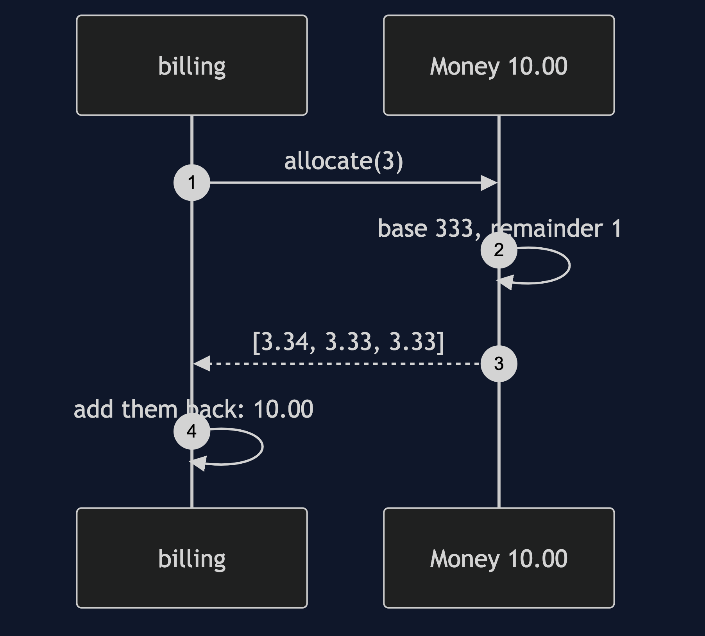
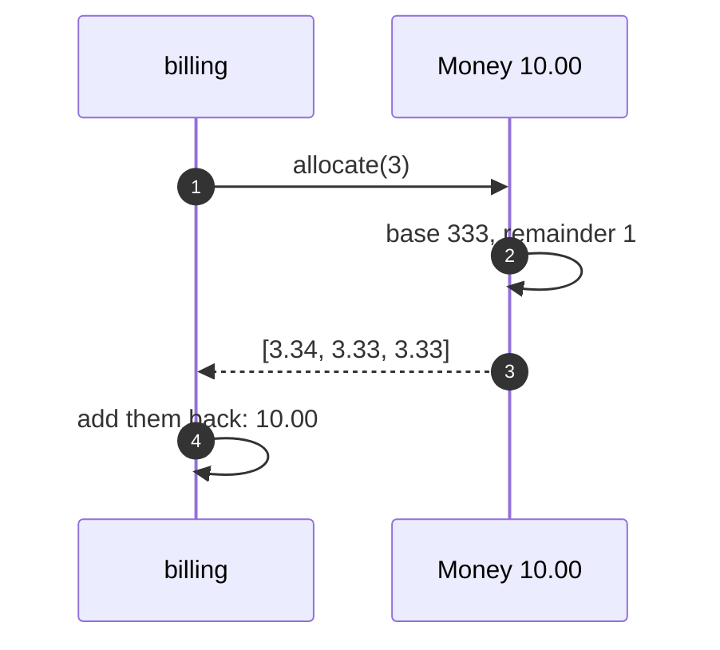

# Value Object Pattern — Sequence Diagram

Written for a listener with the screen off.

Say it in words. The billing code asks to split ten pounds three ways. Money divides the pence by three and finds a remainder of one. It builds three new money objects: the first with one extra penny, and the other two without. Billing adds the three back together and gets exactly ten pounds. Nothing was rounded away, and the original ten pounds is untouched.

Mermaid source

The load-bearing sentence: **the odd penny is a rule, and the rule lives in Money.**
