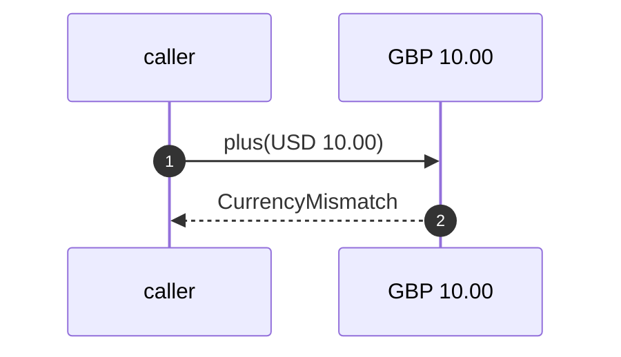
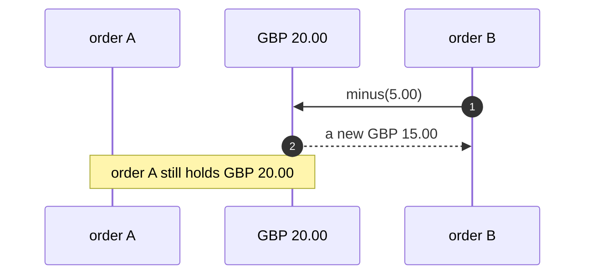
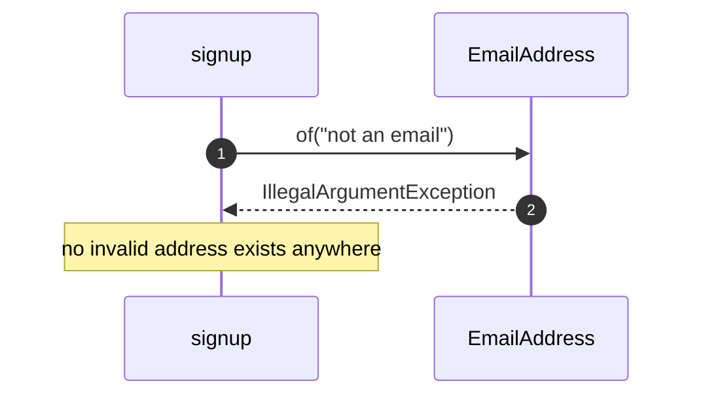
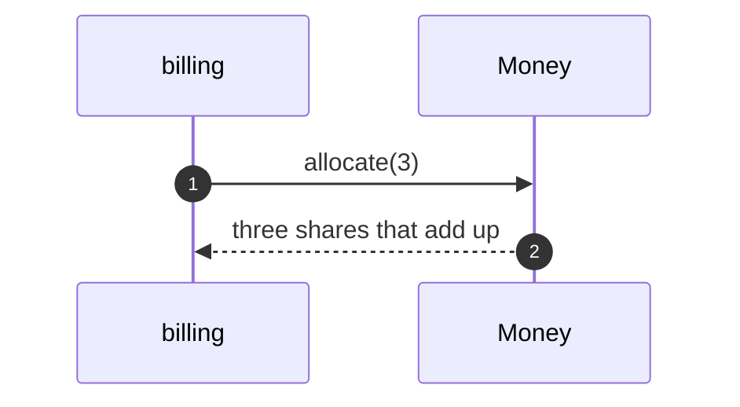

# Value Object Pattern — UML Sequence Diagrams

Four sequences.

## 1. A Refused Mix

Mermaid source

## 2. A Shared Price

Mermaid source

## 3. An Email At The Door

Mermaid source

## 4. An Allocation

Mermaid source

