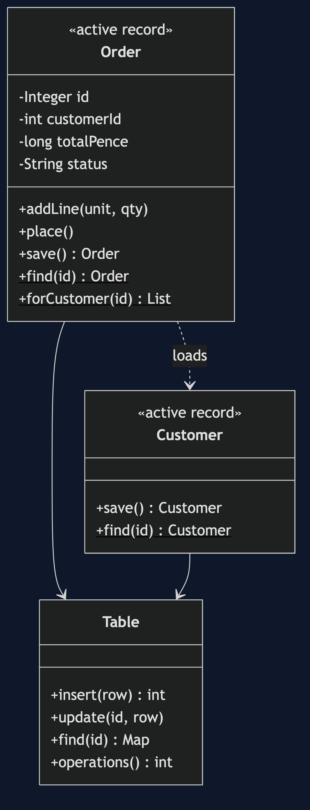
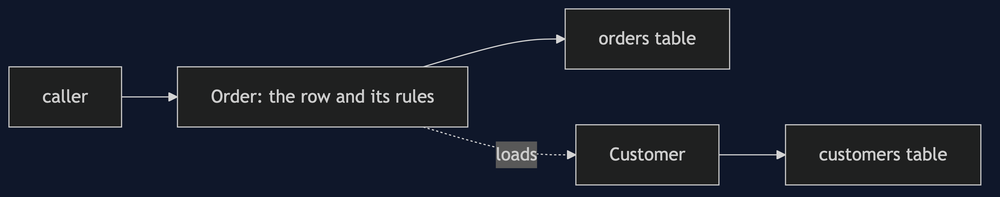
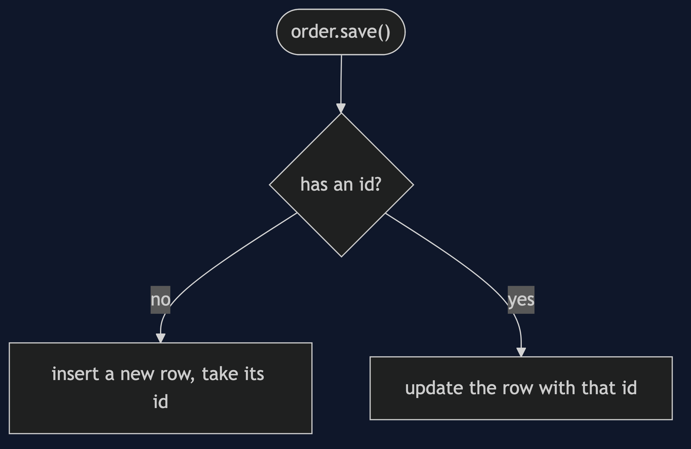
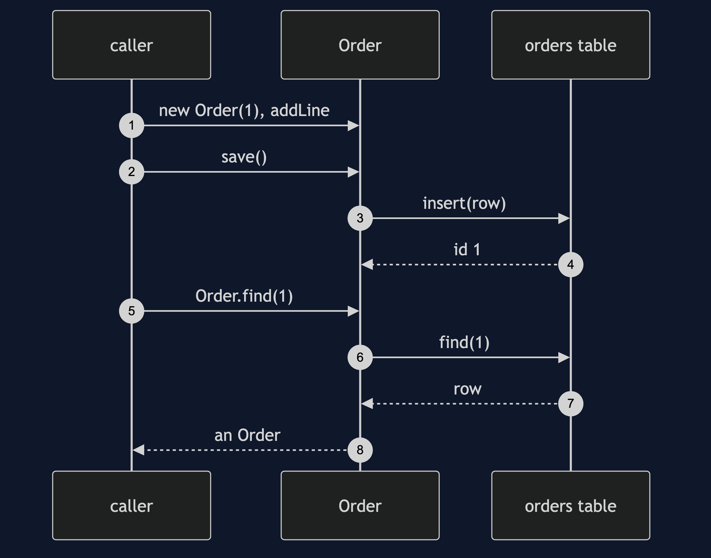
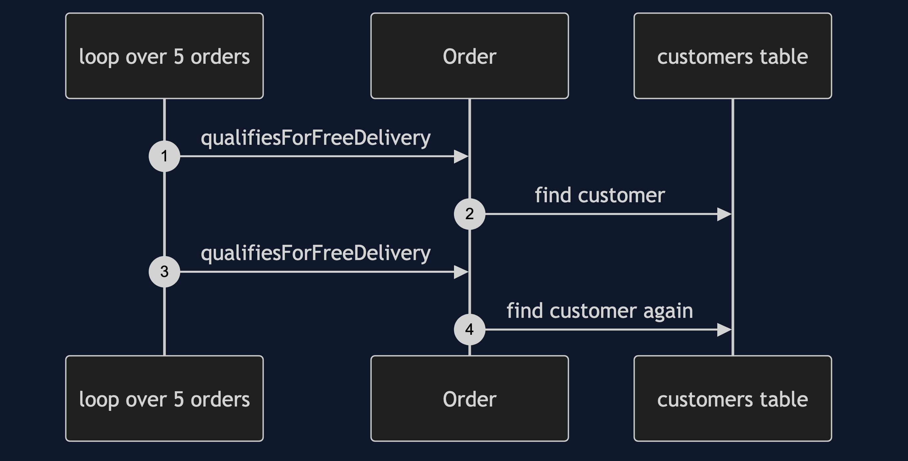

# Active Record Pattern

```
src/main/java/com/jk/explore/activerecord/
├── ActiveRecordDemo.java            the six acts
├── Order.java                       a row that finds, saves and guards itself
├── Customer.java                    another
├── Table.java                       rows in memory, with every operation counted
└── PureDiscount.java                the same delivery rule with no record behind it
```

**An active record is a row that saves itself. Direct and quick, and the class and the table become one thing.**

This project is in [enterprise-design-patterns](..). It is the opposite choice to [Data Mapper](../data-mapper-pattern), which keeps the object and the table apart, and it is the persistence partner of [Transaction Script](../transaction-script-pattern).

## Run

```bash
./gradlew run
```

Six acts. Every number quoted below comes from this program's own output.

```
ONE. A record that saves itself.
  saved order 1 for customer 1, 1600 pence, DRAFT.
  three lines: new, save, find. no repository, no mapper.
TWO. Finders on the class.
  Order.forCustomer(2): 3 orders, totals [500, 1000, 1500].
THREE. The rules are on the record.
  a PLACED order cannot change.
  an empty order cannot be placed.
  what an order may do sits beside what an order is.
FOUR. The bill: a rule that needs the table.
  is a 60.00 order eligible for free delivery? true. table operations to find out: 1.
  the same rule on two numbers: true. table operations: 0.
  to test the rule on the record, the customers table has to exist and hold a customer.
FIVE. The bill: the class is the table.
  a column was renamed. loading an order: the orders table has no column total_pence.
  the fields of the class are the columns of the table. one cannot change without the other.
SIX. The bill: queries you cannot see.
  checking 5 orders for free delivery, 5 eligible: 5 table operations.
  each call looked innocent. each one loaded the customer again.
```

## Test

```bash
./gradlew test
```

2 test classes, 8 test methods, offline, with nothing installed and no framework.

## Technologies and versions

| What | Version | Why it is here |
| --- | --- | --- |
| Java | 21 | The repository standard, via the Gradle toolchain block |
| Gradle | 9.2.1 | The wrapper in this directory; no separate install needed |
| JUnit 5 | 5.10.2 | Test runner |

No framework. A hand-built project stays plain Java so the mechanism is the whole lesson.

## Learning Material

| Document | What it covers |
| --- | --- |
| [`docs/problem-statement.md`](docs/problem-statement.md) | Who saves an order? |
| [`docs/active-record-pattern-explained.md`](docs/active-record-pattern-explained.md) | The pattern, and six acts |
| [`docs/class-diagram.md`](docs/class-diagram.md) | The types |
| [`docs/architecture-diagram.md`](docs/architecture-diagram.md) | A record and its table |
| [`docs/data-flow-diagram.md`](docs/data-flow-diagram.md) | How a record finds and saves itself |
| [`docs/sequence-diagram.md`](docs/sequence-diagram.md) | Written for a listener with the screen off |
| [`docs/uml-diagram.md`](docs/uml-diagram.md) | Four sequences |
| [`docs/animation.html`](docs/animation.html) | The six acts in a browser |
| [`docs/prerequisites.md`](docs/prerequisites.md) | What you need to know |
| [`docs/session.md`](docs/session.md) | A one-hour taught session |
| [`docs/spec.md`](docs/spec.md) | The generated specification |
| [`docs/youtube.md`](docs/youtube.md) | Title, description and chapters |

### The pattern in one picture



### Where each piece sits



### How one request moves



### Who calls whom, in order



### All four sequences




### Video

Built from [`video/scenes.py`](video/scenes.py) by
[`video/build_video.sh`](video/build_video.sh). The rendered file is not
committed; see the repository README for why.

## Where you have already met this

Rails, Laravel, Django models, and any framework where the model class is also the way to load and save it.

## When this is too much

Active Record is rarely too much. It is often too little once the rules grow. Watch for rules that need a table to test, and loops that hide queries.

## Where this sits

This project is in [`enterprise-design-patterns`](..), and is meant to be read with its neighbours there.
