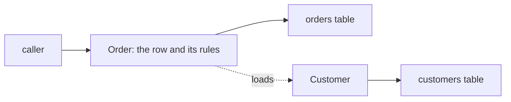

# Active Record Pattern — Architecture Diagram

There is no layer between the object and the table.

Mermaid source

```mermaid
flowchart LR
    C["caller"] --> O["Order: the row and its rules"]
    O --> T["orders table"]
    O -. loads .-> U["Customer"]
    U --> V["customers table"]
```

