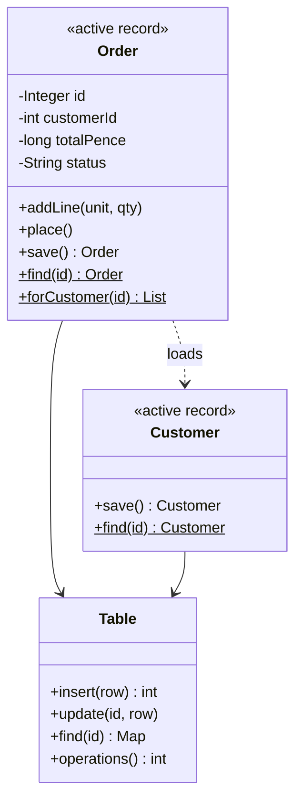

# Active Record Pattern — Class Diagram

The record is the row, and knows how to find and save itself.

Mermaid source

```mermaid
classDiagram
    class Order {
        <<active record>>
        -Integer id
        -int customerId
        -long totalPence
        -String status
        +addLine(unit, qty)
        +place()
        +save() Order
        +find(id)$ Order
        +forCustomer(id)$ List
    }
    class Customer {
        <<active record>>
        +save() Customer
        +find(id)$ Customer
    }
    class Table {
        +insert(row) int
        +update(id, row)
        +find(id) Map
        +operations() int
    }
    Order --> Table
    Customer --> Table
    Order ..> Customer : loads
```

