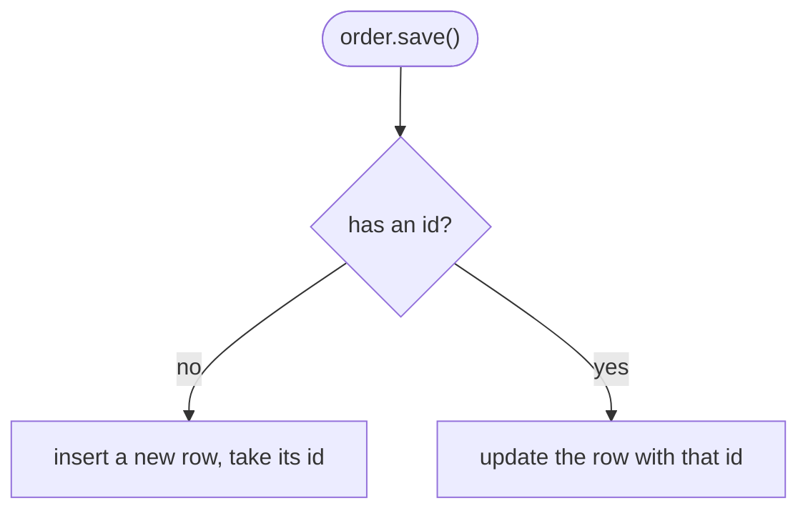

# Active Record Pattern — Data Flow Diagram

What happens on save.

Mermaid source

```mermaid
flowchart TD
    Save(["order.save()"])
    Has{"has an id?"}
    Ins["insert a new row, take its id"]
    Upd["update the row with that id"]
    Save --> Has
    Has -- no --> Ins
    Has -- yes --> Upd
```

