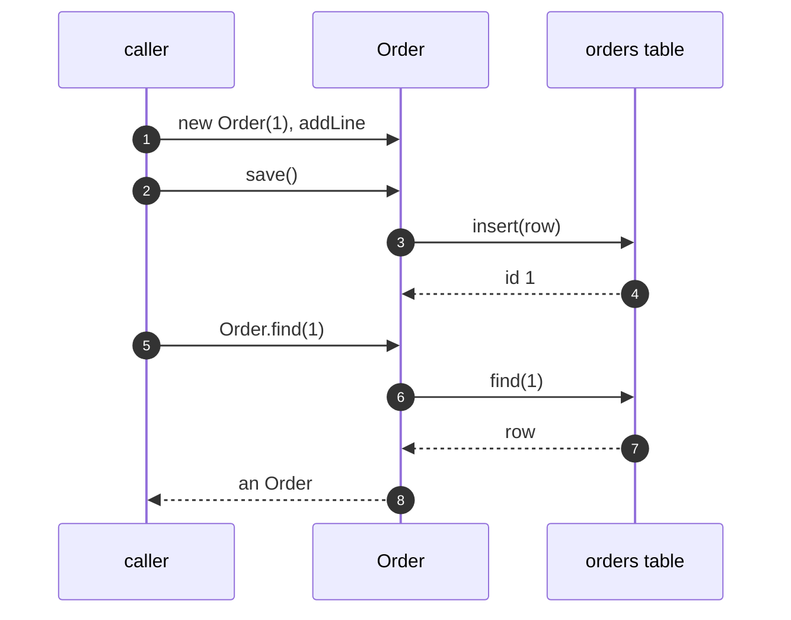

# Active Record Pattern — Sequence Diagram

Written for a listener with the screen off.

Say it in words. The caller creates an order for customer one and adds a line. It calls save. The order has no id yet, so it builds a row from its own fields and inserts it, and takes the new id. Later the caller asks the order class to find that id. The class reads the row and builds an order from it. The record is both the thing and the way in and out.

Mermaid source

The load-bearing sentence: **there is nothing between the object and the table.**
