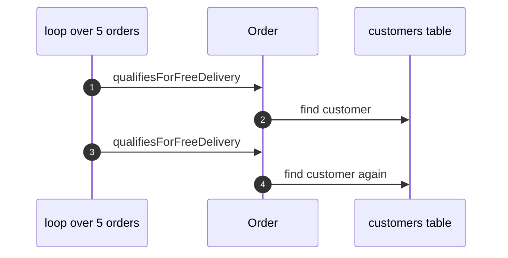

# Active Record Pattern — UML Sequence Diagrams

Four sequences.

## 1. A Hidden Query

Mermaid source

```mermaid
sequenceDiagram
    autonumber
    participant L as loop over 5 orders
    participant O as Order
    participant C as customers table
    L->>O: qualifiesForFreeDelivery
    O->>C: find customer
    L->>O: qualifiesForFreeDelivery
    O->>C: find customer again
```

