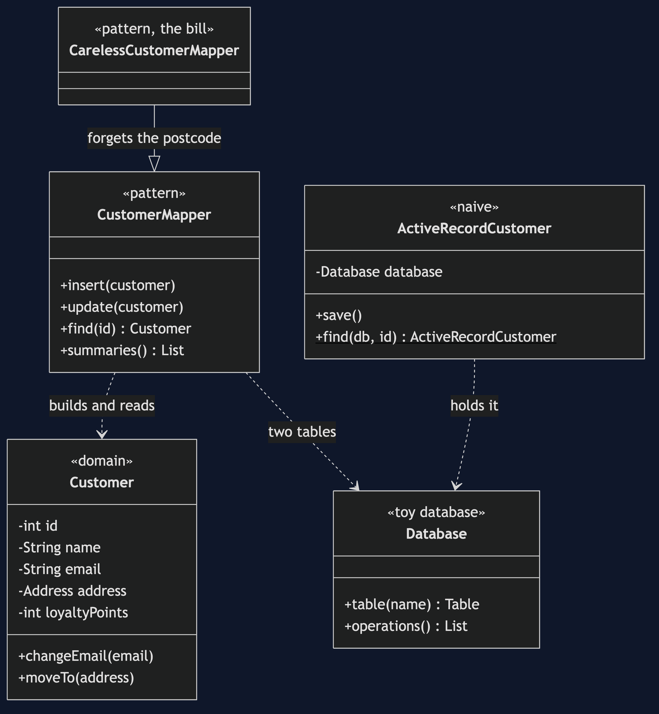
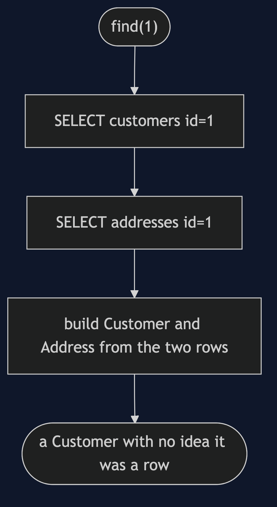

# Data Mapper Pattern

```
src/main/java/com/jk/explore/datamapper/
├── CustomerDemo.java                composition root — the six acts
│
├── toydb/                           ← the category's shared toy database
│   ├── Database.java                 operation counter, buffering, failure on demand
│   ├── Table.java                    a map from id to row
│   └── Row.java                      column names to values
├── domain/
│   ├── Customer.java                 fields and behaviour, no persistence
│   ├── Address.java
│   └── CustomerSummary.java          a second view of the customers table
├── naive/
│   └── ActiveRecordCustomer.java     the object saves itself
│
└── pattern/                         ← the real thing
    ├── CustomerMapper.java           the only class that knows both sides
    └── CarelessCustomerMapper.java   the bill: a field that does not come back
```

**A mapper class moves data between a domain object and its database rows,
so the object never knows it is stored.**

This is the first project in
[enterprise-design-patterns](..). It also builds the toy database that
the rest of the category copies: rows rather than objects, a visible operation
counter, an explicit flush, failure on demand, and no threading.

## Run

```bash
./gradlew run
```

Six acts. Every operation against the toy database is counted, and every
count quoted below comes from that counter.

```
ONE. Active Record — the object saves itself, and it works well.
  customer.save(), find(), change, save():
    INSERT customers id=1
    SELECT customers id=1
    UPDATE customers id=1
  3 operations, one class, one table. For a simple
  application this is the right answer.

TWO. The cost — the domain object cannot exist without the database.
  ActiveRecordCustomer constructor takes a Database, and names its own table:
    table "customers", columns name, email, street, city, postcode
  a plain Customer changed its email with no database anywhere: ada@newmail.example

THREE. The shape Active Record has no answer for.
  one customer, stored across two tables:
    SELECT customers id=1
    SELECT addresses id=1
  one table, feeding a second, smaller object: 2 summaries, from
    SELECT customers (all)
  one class per table cannot say either of these.

FOUR. The pattern — the mapper knows the rows; the customer does not.
  loaded back: Ada Lovelace, Leeds, 10 points
  Customer's fields:
    address
    email
    id
    loyaltyPoints
    name
  Customer's methods: [address, changeEmail, earnPoints, email, id, loyaltyPoints, moveTo, name]
  no table, no column, no SQL, no database.

FIVE. The bill — a hand-written mapping can lose a field silently.
  saved postcode:  LS1 4AB
  loaded postcode: null
  every call succeeded. nothing threw. the field is simply gone.

SIX. Where you have already met this.
  a JPA entity is the domain object; the EntityManager is the mapper.
```

## Test

```bash
./gradlew test
```

Five test classes, 15 test methods, offline, with no database installed.

## Technologies and versions

| What | Version | Why it is here |
| --- | --- | --- |
| Java | 21 | The repository standard, via the Gradle toolchain block |
| Gradle | 9.2.1 | The wrapper in this directory; no separate install needed |
| JUnit 5 | 5.10.2 | Test runner |

No framework. A hand-built project stays plain Java so the mechanism is
the whole lesson.

## Learning Material

| Document | What it covers |
| --- | --- |
| [`docs/problem-statement.md`](docs/problem-statement.md) | The customer, Active Record, and its cost |
| [`docs/data-mapper-pattern-explained.md`](docs/data-mapper-pattern-explained.md) | The pattern, the bill, and where you have met it |
| [`docs/class-diagram.md`](docs/class-diagram.md) | The types |
| [`docs/architecture-diagram.md`](docs/architecture-diagram.md) | Domain, mapper and rows |
| [`docs/data-flow-diagram.md`](docs/data-flow-diagram.md) | One find |
| [`docs/sequence-diagram.md`](docs/sequence-diagram.md) | Written for a listener with the screen off |
| [`docs/uml-diagram.md`](docs/uml-diagram.md) | Four sequences |
| [`docs/animation.html`](docs/animation.html) | The six acts in a browser |
| [`docs/prerequisites.md`](docs/prerequisites.md) | What you need to know |
| [`docs/session.md`](docs/session.md) | A one-hour taught session |
| [`docs/spec.md`](docs/spec.md) | The generated specification |
| [`docs/youtube.md`](docs/youtube.md) | Title, description and chapters |

### The pattern in one picture



### Where each piece sits


### How one find moves



### Who calls whom, in order


### All four sequences


### Video

Built from [`video/scenes.py`](video/scenes.py) by
[`video/build_video.sh`](video/build_video.sh). The rendered file is not
committed; see the repository README for why.

## Where you have already met this

A JPA entity is the domain object, and the `EntityManager` is the mapper.
Hibernate writes the mapping code that act five shows can go wrong.

## When this is too much

For a simple application with one class per table, Active Record is simpler
and is the right answer.

## Where this sits

This is the first project in [`enterprise-design-patterns`](..). The pattern
it builds is the one the next projects assume: objects and rows are separate
things.
