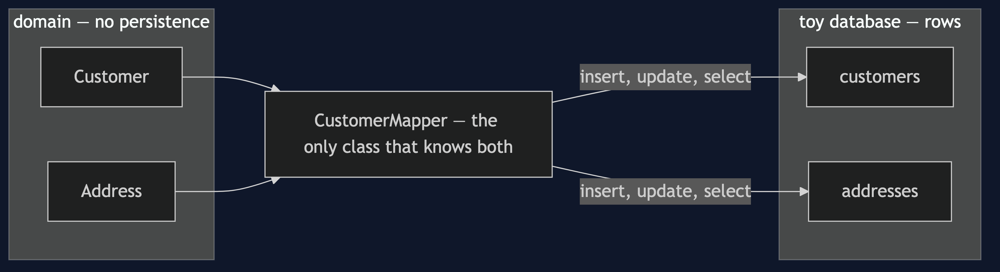
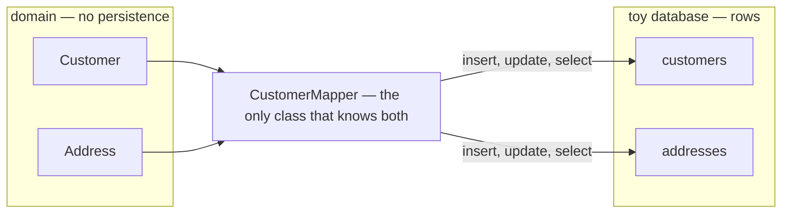

# Data Mapper Pattern — Architecture Diagram

The domain sits on one side of the mapper and the rows on the other.

Mermaid source

```mermaid
flowchart LR
    subgraph Domain["domain — no persistence"]
        C["Customer"]
        A["Address"]
    end
    M["CustomerMapper — the only class that knows both"]
    subgraph Store["toy database — rows"]
        T1["customers"]
        T2["addresses"]
    end
    C --> M
    A --> M
    M -->|insert, update, select| T1
    M -->|insert, update, select| T2
```

