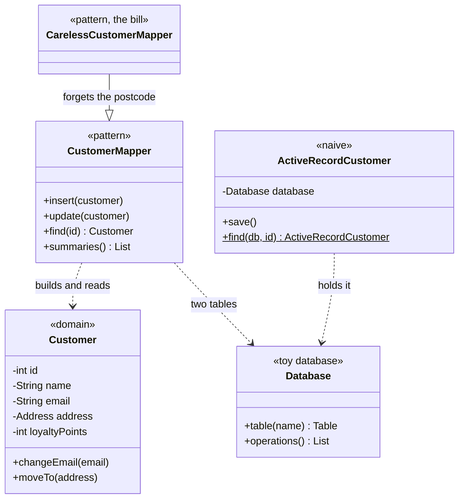

# Data Mapper Pattern — Class Diagram

`Customer` has no arrow to the database. Only the mapper does.

Mermaid source

```mermaid
classDiagram
    class Customer {
        <<domain>>
        -int id
        -String name
        -String email
        -Address address
        -int loyaltyPoints
        +changeEmail(email)
        +moveTo(address)
    }
    class ActiveRecordCustomer {
        <<naive>>
        -Database database
        +save()
        +find(db, id)$ ActiveRecordCustomer
    }
    class CustomerMapper {
        <<pattern>>
        +insert(customer)
        +update(customer)
        +find(id) Customer
        +summaries() List
    }
    class CarelessCustomerMapper {
        <<pattern, the bill>>
    }
    class Database {
        <<toy database>>
        +table(name) Table
        +operations() List
    }
    CustomerMapper ..> Customer : builds and reads
    CustomerMapper ..> Database : two tables
    CarelessCustomerMapper --|> CustomerMapper : forgets the postcode
    ActiveRecordCustomer ..> Database : holds it
```

