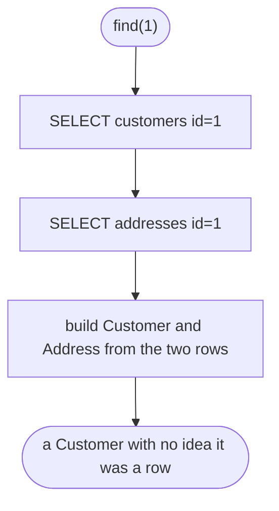

# Data Mapper Pattern — Data Flow Diagram

One `find`, from an id to a customer.

Mermaid source

```mermaid
flowchart TD
    Ask(["find(1)"])
    S1["SELECT customers id=1"]
    S2["SELECT addresses id=1"]
    Build["build Customer and Address from the two rows"]
    Out(["a Customer with no idea it was a row"])
    Ask --> S1 --> S2 --> Build --> Out
```

