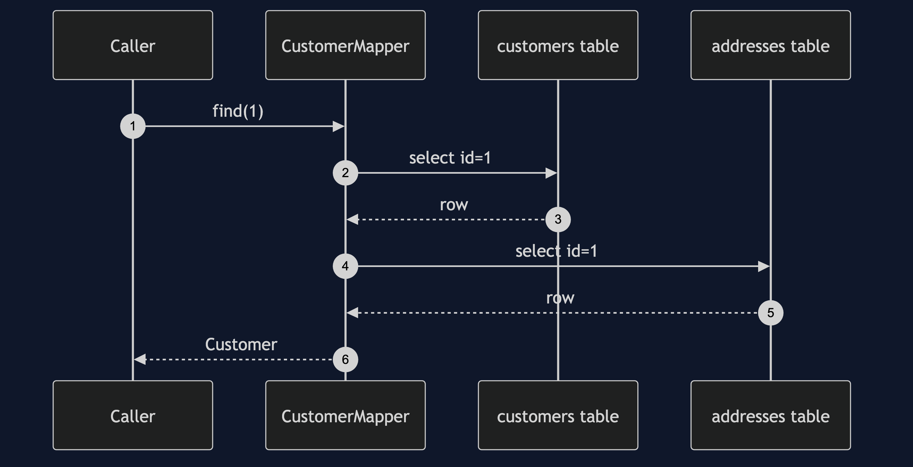
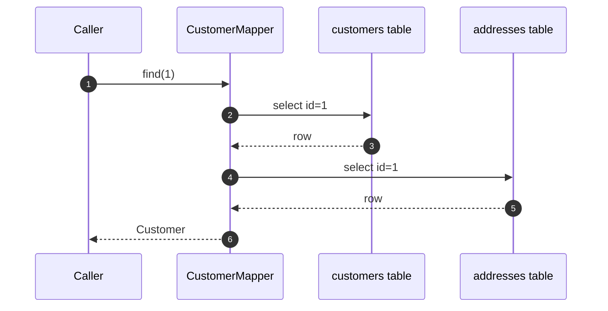

# Data Mapper Pattern — Sequence Diagram

Written for a listener with the screen off.

Say it in words. The caller asks the mapper to find customer one. The mapper
asks the customers table for row one, then asks the addresses table for row
one. It builds an address from the second row, builds a customer from the
first, and hands the customer back. The customer never spoke to a table.

Mermaid source

The load-bearing sentence: **the customer never spoke to a table.**
