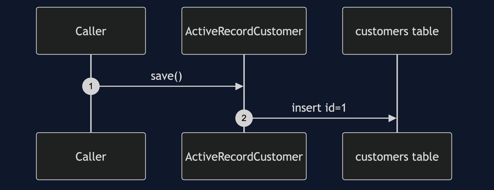
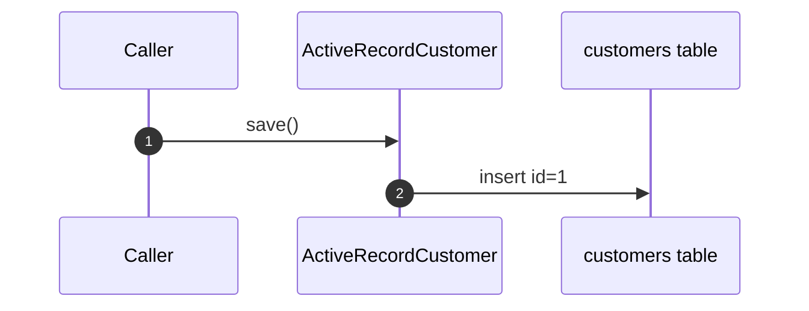
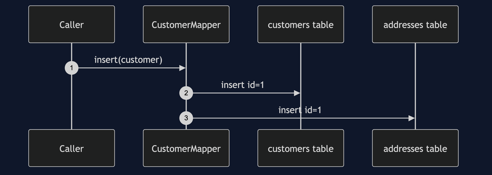
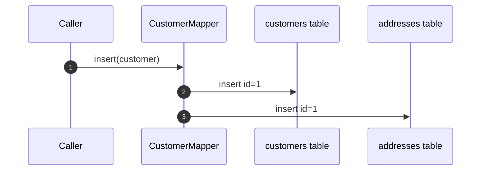
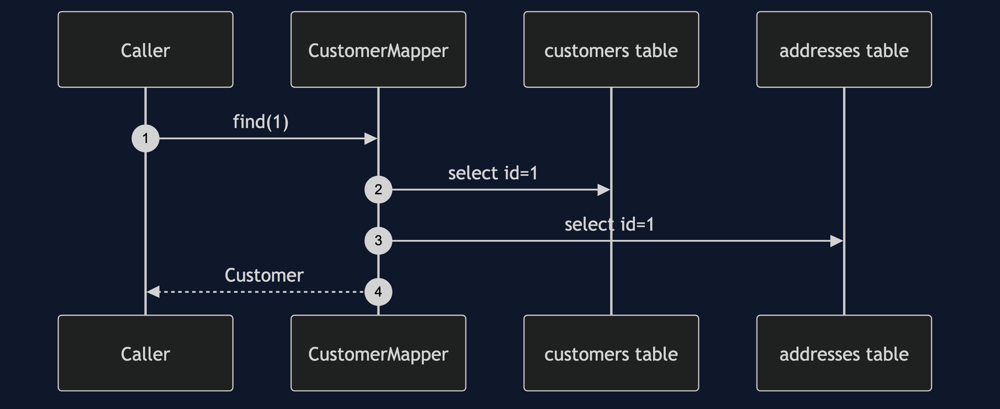
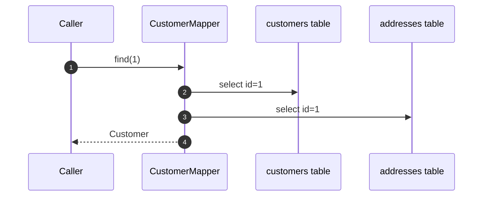
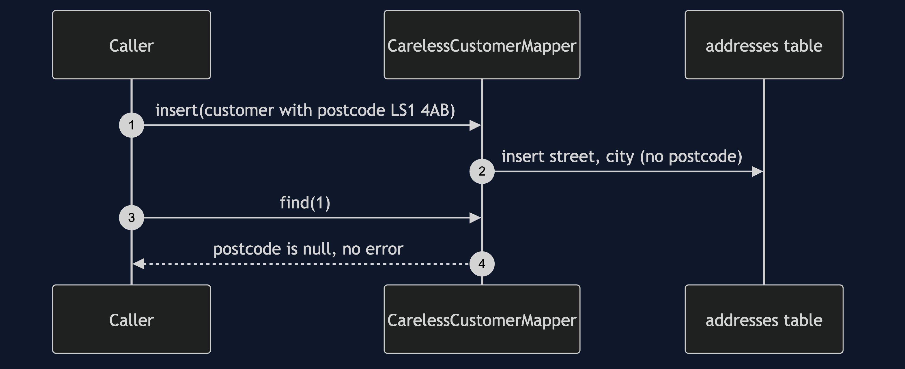
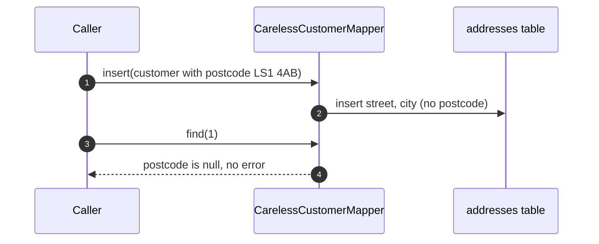

# Data Mapper Pattern — UML Sequence Diagrams

Four sequences: Active Record saving, the mapper inserting, the mapper
finding, and a careless mapper.

## 1. Active Record Saves Itself

Mermaid source

## 2. The Mapper Inserts

Mermaid source

## 3. The Mapper Finds

Mermaid source

## 4. A Careless Mapper

Mermaid source

