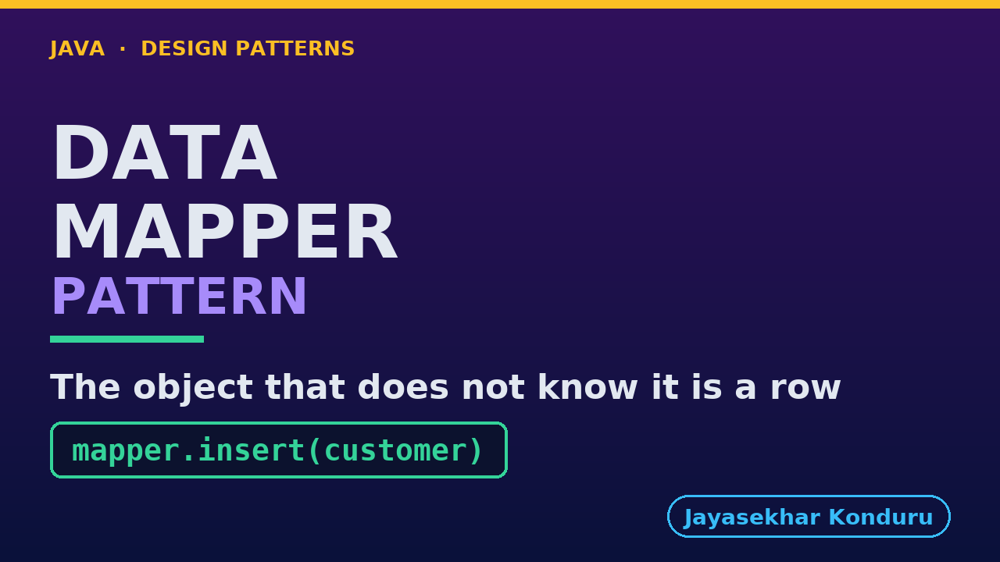

# YouTube — Data Mapper Pattern

Everything needed to publish `video/data-mapper-pattern-explained.mp4`. Copy the fields straight out of this file.

Chapter timings are generated from the video's `.srt`. Re-run `python3 docs/make_youtube_docs.py data-mapper` after any change to the narration, or they will be wrong.

## Title

```
Data Mapper in Java - The Object That Is Not A Row
```

50 characters — under the 60 YouTube shows before truncating in search results.

## Description

The first two lines are what a viewer sees above the fold, so they carry the hook rather than the boilerplate.

```
Data Mapper pattern in Java, explained with an online store customer, asking who should know how a customer is saved. A data mapper is a separate class that moves data between an object and its database rows, so the object never knows it is stored, like movers who know how to pack furniture that cannot pack itself. We show when Active Record is fine and what it costs, meet a shape it cannot express, and move the storage into a mapper. Then the bill: a class per entity, and a hand-written mapping that loses a field without any error. A mapper frees your objects from the database, at the price of an extra class you must test.

CHAPTERS
00:00 Introduction
00:51 The Scenario
01:10 Active Record Works
01:36 The Cost
02:05 A Shape It Cannot Say
02:35 The Pattern
02:58 What The Customer Looks Like
03:25 The Bill: A Class Per Entity
03:51 The Bill: A Silent Field
04:18 The Toy Database
04:38 Where You Have Met This
05:02 What Is Real Here
05:24 When This Is Too Much
05:46 Thanks for Watching

SOURCE CODE, WRITTEN NOTES AND AN INTERACTIVE ANIMATION
https://github.com/jk-boot-up/java-design-patterns/tree/main/gradle-java/enterprise-design-patterns/data-mapper-pattern

WHAT YOU NEED FIRST
Java 21 and a working knowledge of classes and interfaces. No prior design-pattern knowledge is assumed. The full prerequisites are in docs/prerequisites.md in the repository.
```

## Chapters

YouTube renders these as chapters only if there are at least three and the first is at `00:00`.

```
00:00 Introduction
00:51 The Scenario
01:10 Active Record Works
01:36 The Cost
02:05 A Shape It Cannot Say
02:35 The Pattern
02:58 What The Customer Looks Like
03:25 The Bill: A Class Per Entity
03:51 The Bill: A Silent Field
04:18 The Toy Database
04:38 Where You Have Met This
05:02 What Is Real Here
05:24 When This Is Too Much
05:46 Thanks for Watching
```

## Tags

```
data mapper pattern, active record, java persistence, design patterns, java design patterns, gang of four, java 21, software design, clean code, object oriented design, java tutorial, ecommerce, programming tutorial
```

215 characters, under YouTube's 500 limit.

## Thumbnail



**Upload `docs/thumbnail.png`** — 1280×720, the size YouTube recommends, generated by `docs/make_thumbnails.py`. It is deliberately not the same image as the video's opening frame: a thumbnail is judged at about 360 pixels wide in a search result, so this one carries only the pattern name, one line of promise and one short piece of code, each set large enough to survive the shrink.

`video/poster.png` is the 1920×1080 opening frame, produced by the video build. It stays in the repository as the title card; it is not what gets uploaded.

YouTube will not pick the thumbnail up on its own — upload it under **Details → Thumbnail → Upload file**. A custom thumbnail requires a verified channel.

## Upload checklist

- [ ] Upload `video/data-mapper-pattern-explained.mp4` (1080p, H.264, 30 fps, AAC 48 kHz — already YouTube's recommended settings, no re-encode needed)
- [ ] Set the video language to **English** first, or the subtitle option may not appear
- [ ] Add subtitles: *Video elements → Add subtitles → Upload file → With timing* → `video/data-mapper-pattern-explained.srt`
- [ ] Upload `docs/thumbnail.png` as the thumbnail — do not let YouTube auto-pick a frame
- [ ] Paste the title, description and tags from above
- [ ] Add to the **Java Design Patterns** playlist, in learning order
- [ ] Wait for 1080p processing before sharing the link — code slides are unreadable at 360p

## Cards and end screen

End screen links to whichever pattern video goes up next — set it at upload time rather than assuming an order.

Add a card partway through pointing at the playlist, so a viewer who arrives at this pattern from search can find the rest of the series.

## Runtime

Approximately 06:24, narrated at 145 words per minute.
