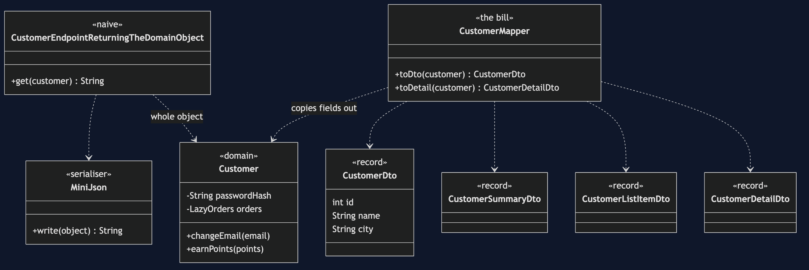

# DTO Pattern

```
src/main/java/com/jk/explore/dto/
├── CustomerEndpointDemo.java        composition root — the six acts
│
├── json/
│   └── MiniJson.java                 a tiny serialiser: it walks every field, as Jackson does
├── domain/
│   ├── Customer.java                 private fields, a lazy history, and rules
│   ├── LazyOrders.java  Order.java  OrderLine.java
├── naive/
│   ├── CustomerEndpointReturningTheDomainObject.java
│   └── CustomerAfterRename.java      the same customer after a private field is renamed
│
└── dto/                             ← the real thing
    ├── CustomerDto.java              a flat record for the boundary
    ├── CustomerSummaryDto.java  CustomerListItemDto.java  CustomerDetailDto.java
    └── CustomerMapper.java           the mapping code, and the bill
```

**A separate object shaped for the boundary: a flat record carrying exactly what the client needs, while the domain object stays inside.**

This is the last hand-built project in [enterprise-design-patterns](..). It comes last because you must know what is inside before deciding what leaves. It is Backends for Frontends at the level of one object, not one deployment.

## Run

```bash
./gradlew run
```

Six acts. Every size and count is measured from the real payload.

```
DTO — the object that crosses the boundary

ONE. A REST endpoint returns the domain object.
  the JSON starts: {"id":7,"name":"Ada Lovelace","email":"ada@example.com","passwordHash":"$2a$10$N9qo8uLOickgx2ZMRZoMyeIjZAgcfl7p92ldGxad6...
  contains the password hash: true
  order history in it: true, history loaded 1 time, just to serialise
  size: 5297 characters, for a customer's name and city.

TWO. The field name the client depends on is a private field.
  a client reads the key "name": Ada Lovelace
  the name changes, and the client still gets it: Augusta Ada King
  a developer renames the private field name to fullName. the JSON is now: {"id":7,"fullName":"Ada Lovelace","city":"London"}
  the client reads the key "name": null
  the JSON keys are the names of private fields. nobody may rename them now.

THREE. The pattern — a DTO shaped for the boundary.
  domain object: 5297 characters
  DTO:           46 characters
  DTO payload:   {"id":7,"name":"Ada Lovelace","city":"London"}
  order history loaded by the DTO: 0 times.

FOUR. A DTO is not a domain model — one of each.
  CustomerDto is a record: true, methods of its own: []
  Customer has rules: [changeEmail, earnPoints, rename]
  the domain object refuses a bad email: not an email address: nonsense
  the DTO would carry it without complaint. it is data, not a model.

FIVE. The bill — mapping code, everywhere.
    CustomerDto: [id, name, city]
    CustomerSummaryDto: [id, name]
    CustomerListItemDto: [id, name, city, loyaltyPoints]
    CustomerDetailDto: [id, name, email, city, loyaltyPoints, orderCount]
  Customer has 7 fields. four DTOs carry 15 between them.
  four mapping methods copy them across by hand. add a field and every one is a place to forget.

SIX. Where you have already met this.
  a Java record returned from a Spring controller is a DTO, and Jackson writes its JSON.
  it is Backends for Frontends, at the level of one object instead of one deployment.
  MapStruct writes the mapping code for you: worth taking once you have felt the tedium.
```

## Test

```bash
./gradlew test
```

2 test classes, 8 test methods, offline, with no database and no framework.

## Technologies and versions

| What | Version | Why it is here |
| --- | --- | --- |
| Java | 21 | The repository standard, via the Gradle toolchain block |
| Gradle | 9.2.1 | The wrapper in this directory; no separate install needed |
| JUnit 5 | 5.10.2 | Test runner |

No framework. A hand-built project stays plain Java so the mechanism is the whole lesson.

## Learning Material

| Document | What it covers |
| --- | --- |
| [`docs/problem-statement.md`](docs/problem-statement.md) | The endpoint, and what leaks |
| [`docs/dto-pattern-explained.md`](docs/dto-pattern-explained.md) | The DTO, what it is not, and the bill |
| [`docs/class-diagram.md`](docs/class-diagram.md) | The types |
| [`docs/architecture-diagram.md`](docs/architecture-diagram.md) | Domain, mapper, boundary, client |
| [`docs/data-flow-diagram.md`](docs/data-flow-diagram.md) | One request, leaking or not |
| [`docs/sequence-diagram.md`](docs/sequence-diagram.md) | Written for a listener with the screen off |
| [`docs/uml-diagram.md`](docs/uml-diagram.md) | Four sequences |
| [`docs/animation.html`](docs/animation.html) | The six acts in a browser |
| [`docs/prerequisites.md`](docs/prerequisites.md) | What you need to know |
| [`docs/session.md`](docs/session.md) | A one-hour taught session |
| [`docs/spec.md`](docs/spec.md) | The generated specification |
| [`docs/youtube.md`](docs/youtube.md) | Title, description and chapters |

### The pattern in one picture



### Where each piece sits


### How one request moves


### Who calls whom, in order


### All four sequences


### Video

Built from [`video/scenes.py`](video/scenes.py) by
[`video/build_video.sh`](video/build_video.sh). The rendered file is not
committed; see the repository README for why.

## Where you have already met this

A Java record returned from a Spring controller is a DTO, and Jackson writes its JSON.

## When this is too much

For an internal call between two classes in one module, a DTO is a needless copy. It earns its place at a boundary you do not control.

## Where this sits

This is the last hand-built project in [`enterprise-design-patterns`](..). It is [Backends for Frontends](../../micro-services-design-patterns) at the level of one object.
