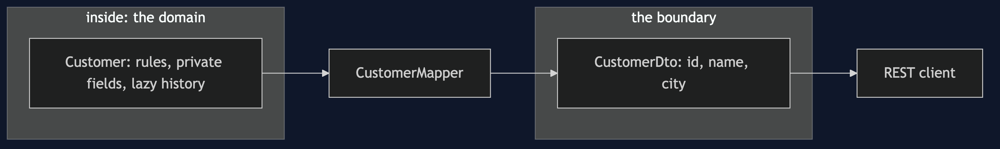
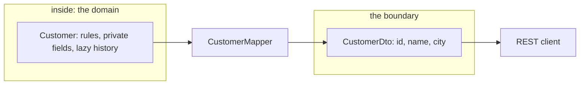

# DTO Pattern — Architecture Diagram

The boundary sits between the domain and the client.

Mermaid source

```mermaid
flowchart LR
    subgraph Inside["inside: the domain"]
        C["Customer: rules, private fields, lazy history"]
    end
    M["CustomerMapper"]
    subgraph Boundary["the boundary"]
        D["CustomerDto: id, name, city"]
    end
    Client["REST client"]
    C --> M --> D --> Client
```

