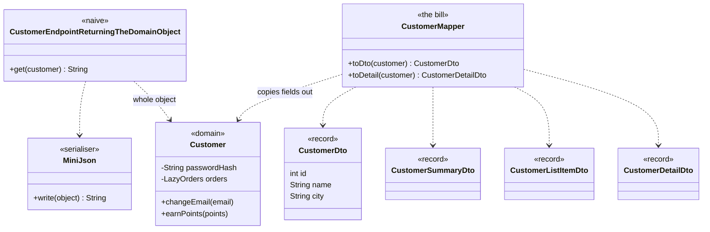

# DTO Pattern — Class Diagram

`Customer` never appears in a JSON payload. Only the DTO records do.

Mermaid source

```mermaid
classDiagram
    class Customer {
        <<domain>>
        -String passwordHash
        -LazyOrders orders
        +changeEmail(email)
        +earnPoints(points)
    }
    class CustomerEndpointReturningTheDomainObject {
        <<naive>>
        +get(customer) String
    }
    class MiniJson {
        <<serialiser>>
        +write(object) String
    }
    class CustomerDto {
        <<record>>
        int id
        String name
        String city
    }
    class CustomerSummaryDto {
        <<record>>
    }
    class CustomerListItemDto {
        <<record>>
    }
    class CustomerDetailDto {
        <<record>>
    }
    class CustomerMapper {
        <<the bill>>
        +toDto(customer) CustomerDto
        +toDetail(customer) CustomerDetailDto
    }
    CustomerEndpointReturningTheDomainObject ..> MiniJson
    CustomerEndpointReturningTheDomainObject ..> Customer : whole object
    CustomerMapper ..> Customer : copies fields out
    CustomerMapper ..> CustomerDto
    CustomerMapper ..> CustomerSummaryDto
    CustomerMapper ..> CustomerListItemDto
    CustomerMapper ..> CustomerDetailDto
```

