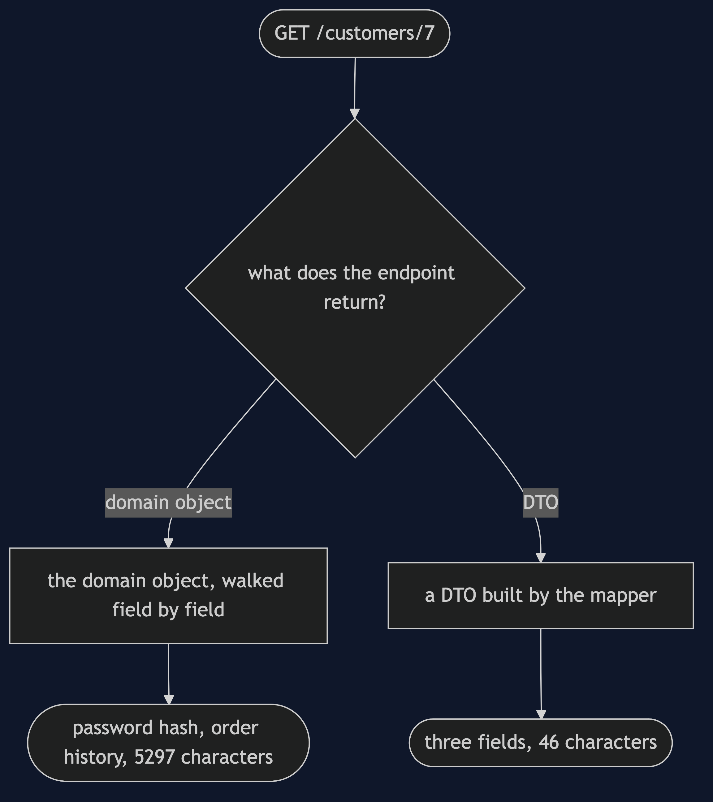
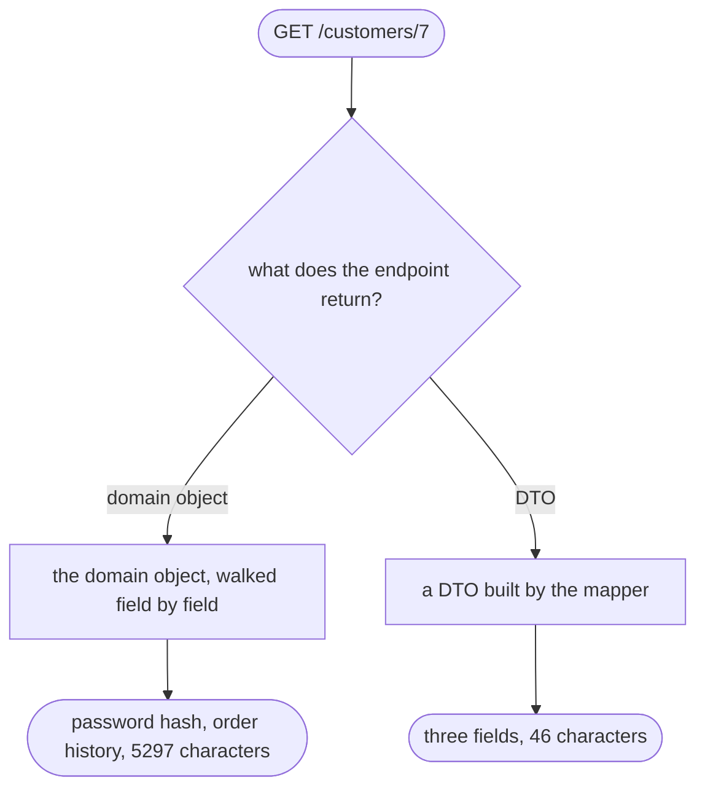

# DTO Pattern — Data Flow Diagram

One request, to a payload that leaks or one that does not.

Mermaid source

```mermaid
flowchart TD
    Req(["GET /customers/7"])
    Which{"what does the endpoint return?"}
    Whole["the domain object, walked field by field"]
    Dto["a DTO built by the mapper"]
    Leak(["password hash, order history, 5297 characters"])
    Ok(["three fields, 46 characters"])
    Req --> Which
    Which -- domain object --> Whole --> Leak
    Which -- DTO --> Dto --> Ok
```

