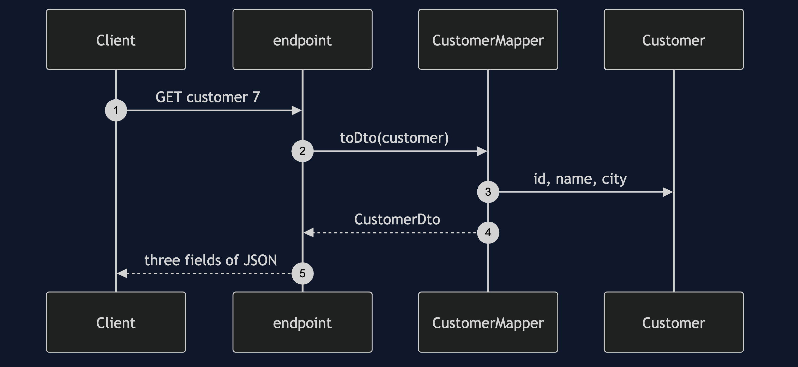
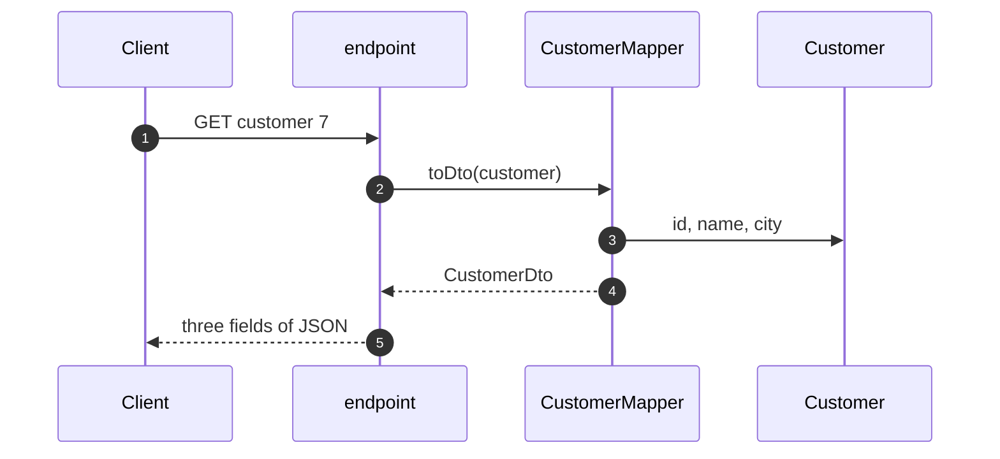

# DTO Pattern — Sequence Diagram

Written for a listener with the screen off.

Say it in words. The client asks the endpoint for customer seven. The endpoint loads the customer and hands it to the mapper. The mapper reads the id, the name and the city, and builds a small record with just those. The endpoint serialises the record. The password hash and the order history are never touched, because the record has no place to put them.

Mermaid source

The load-bearing sentence: **the record has no place to put the password hash.**
