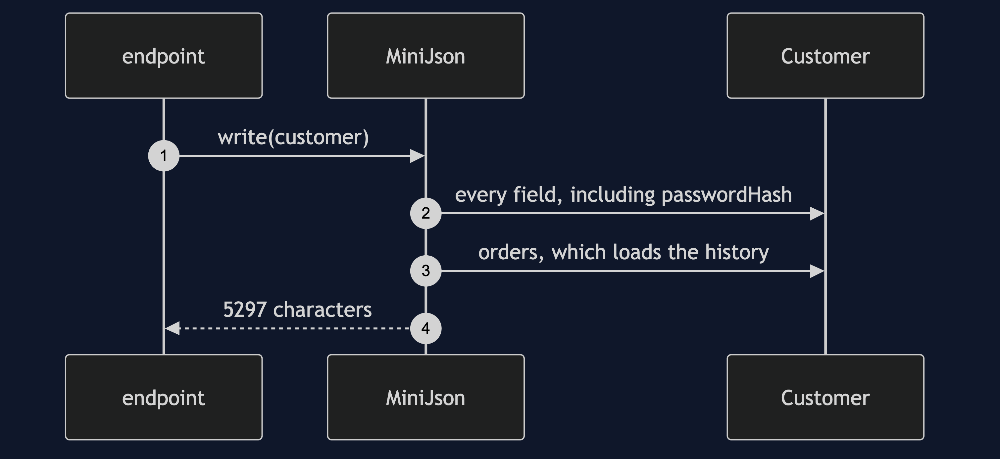
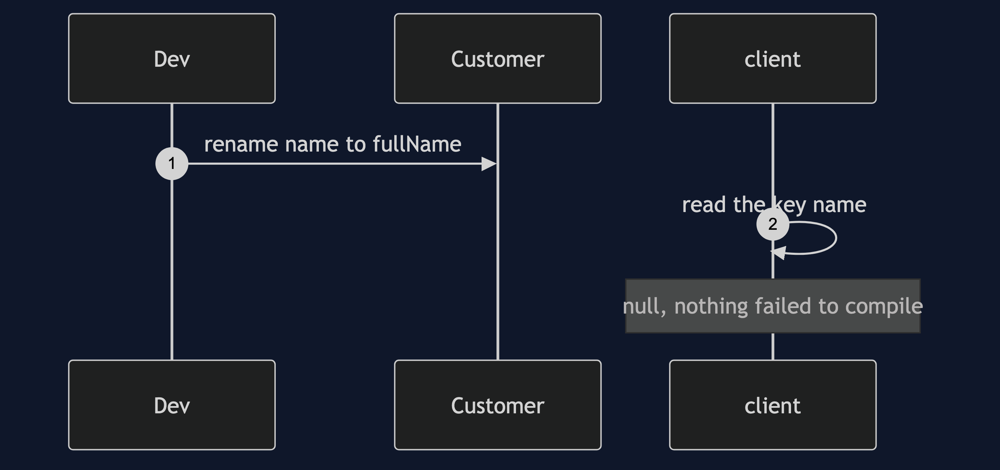
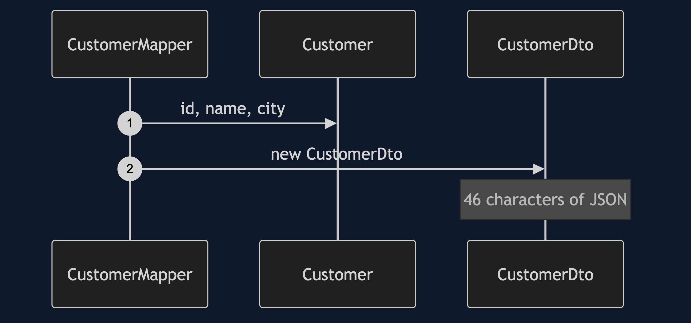
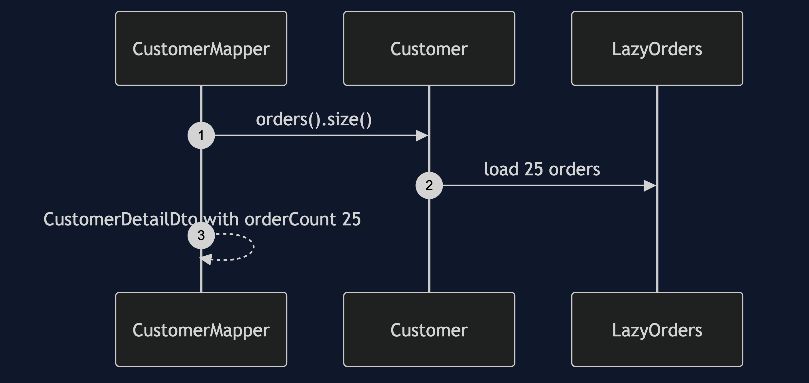

# DTO Pattern — UML Sequence Diagrams

Four sequences.

## 1. The Domain Object Is Serialised

## 2. A Private Field Is Renamed

## 3. The Mapper Builds A DTO

## 4. A Detail DTO Loads The History

