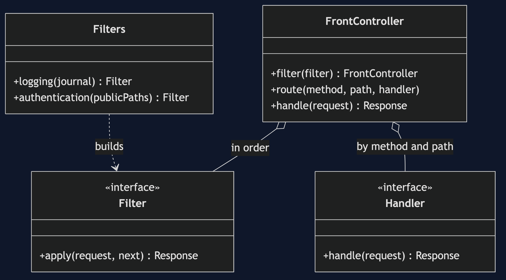
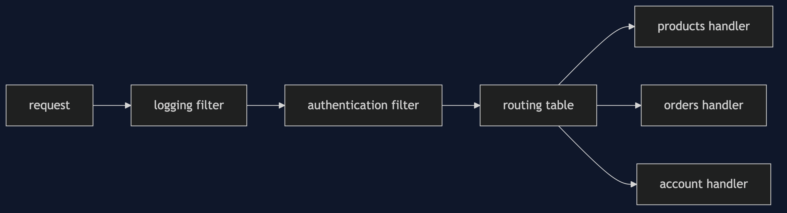
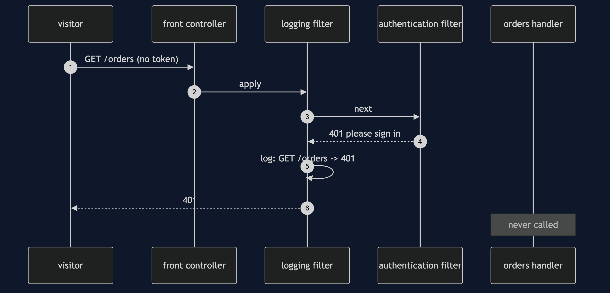
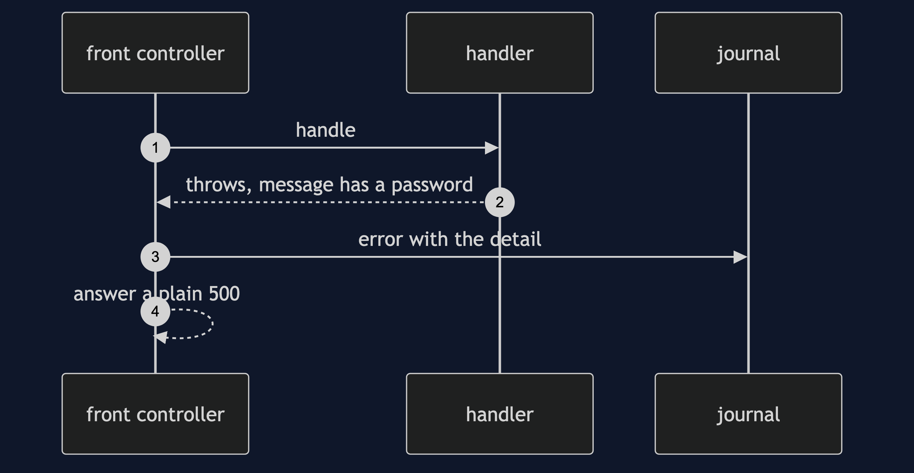

# Front Controller Pattern

```
src/main/java/com/jk/explore/frontcontroller/
├── FrontControllerDemo.java         the six acts
├── FrontController.java             the one entry point: filters, routes, error handling
├── Filters.java                     logging, authentication, and a buggy one
├── Handlers.java  Handler.java      the pages, which do only their own work
├── Request.java  Response.java  Filter.java  Journal.java
│
└── naive/
    └── NaiveHandlers.java            every handler looks after itself
```

**A front controller is one door every request goes through, so shared work is done once and cannot be forgotten.**

This project is in [enterprise-design-patterns](..). It is the entry point of a web application, and the natural place to put what [Service Layer](../service-layer-pattern) and the handlers should not have to think about. It is also the pattern behind Spring MVC's `DispatcherServlet`.

## Run

```bash
./gradlew run
```

Six acts. Every number quoted below comes from this program's own output.

```
ONE. Every handler looks after itself.
  /orders with no sign-in: 200 ada's orders: ORD-1, ORD-2
  /account with no sign-in: 401 please sign in
  requests logged: 0 of 2. the orders handler has no login check and no log line, and the account handler logs only what it accepts.
TWO. One entry point.
  /orders with no sign-in: 401 please sign in
  /orders signed in:       200 ada's orders: ORD-1, ORD-2
  /products, public:       200 the catalogue: mug, tea, machine
  the login check is written once. no handler can forget it, because no handler has it.
THREE. Routes in one table.
  /nowhere:        404 no such page
  POST /products:  405 method not allowed
  every unknown page and wrong method is answered the same way, in one place.
FOUR. Everything is logged, even what is refused.
  GET /orders -> 401
  GET /orders -> 200
  GET /nowhere -> 404
  the refused request and the missing page are in the log. the naive handlers logged neither.
FIVE. Failures are handled once.
  a handler throws. the customer sees: 500 something went wrong.
  the log has the detail: error on /broken: database password is hunter2.
  the message with the password stayed in the log, and never reached the customer.
SIX. The bill: one door.
  one filter with a bug in it. /products: 500 something went wrong, /orders: 500 something went wrong, /account: 500 something went wrong.
  every page is down at once. the front controller is the one place everything depends on.
```

## Test

```bash
./gradlew test
```

2 test classes, 8 test methods, offline, with nothing installed and no framework.

## Technologies and versions

| What | Version | Why it is here |
| --- | --- | --- |
| Java | 21 | The repository standard, via the Gradle toolchain block |
| Gradle | 9.2.1 | The wrapper in this directory; no separate install needed |
| JUnit 5 | 5.10.2 | Test runner |

No framework. A hand-built project stays plain Java so the mechanism is the whole lesson.

## Learning Material

| Document | What it covers |
| --- | --- |
| [`docs/problem-statement.md`](docs/problem-statement.md) | Shared work, and who does it |
| [`docs/front-controller-pattern-explained.md`](docs/front-controller-pattern-explained.md) | The pattern, and six acts |
| [`docs/class-diagram.md`](docs/class-diagram.md) | The types |
| [`docs/architecture-diagram.md`](docs/architecture-diagram.md) | Requests, one door, and handlers |
| [`docs/data-flow-diagram.md`](docs/data-flow-diagram.md) | What a request passes through |
| [`docs/sequence-diagram.md`](docs/sequence-diagram.md) | Written for a listener with the screen off |
| [`docs/uml-diagram.md`](docs/uml-diagram.md) | Four sequences |
| [`docs/animation.html`](docs/animation.html) | The six acts in a browser |
| [`docs/prerequisites.md`](docs/prerequisites.md) | What you need to know |
| [`docs/session.md`](docs/session.md) | A one-hour taught session |
| [`docs/spec.md`](docs/spec.md) | The generated specification |
| [`docs/youtube.md`](docs/youtube.md) | Title, description and chapters |

### The pattern in one picture



### Where each piece sits



### How one request moves


### Who calls whom, in order



### All four sequences




### Video

Built from [`video/scenes.py`](video/scenes.py) by
[`video/build_video.sh`](video/build_video.sh). The rendered file is not
committed; see the repository README for why.

## Where you have already met this

Spring's `DispatcherServlet`, servlet filters, Express and Koa middleware, and every API gateway.

## When this is too much

For a program with one endpoint, a front controller is a door in front of a door. Its risk is being a single point of failure, so keep it simple and tested.

## Where this sits

This project is in [`enterprise-design-patterns`](..), and is meant to be read with its neighbours there.
