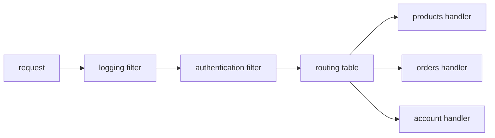

# Front Controller Pattern — Architecture Diagram

Every request passes the filters, then the routing table, then a handler.

Mermaid source

```mermaid
flowchart LR
    R["request"] --> L["logging filter"]
    L --> A["authentication filter"]
    A --> T["routing table"]
    T --> P["products handler"]
    T --> O["orders handler"]
    T --> C["account handler"]
```

