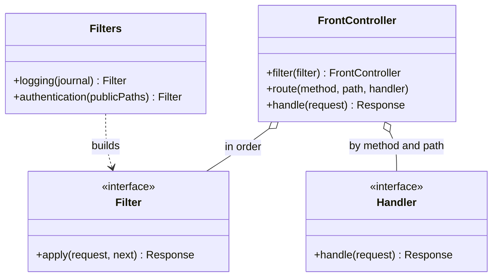

# Front Controller Pattern — Class Diagram

One controller runs filters, then routes to a handler.

Mermaid source

```mermaid
classDiagram
    class FrontController {
        +filter(filter) FrontController
        +route(method, path, handler)
        +handle(request) Response
    }
    class Filter {
        <<interface>>
        +apply(request, next) Response
    }
    class Handler {
        <<interface>>
        +handle(request) Response
    }
    class Filters {
        +logging(journal) Filter
        +authentication(publicPaths) Filter
    }
    FrontController o-- Filter : in order
    FrontController o-- Handler : by method and path
    Filters ..> Filter : builds
```

