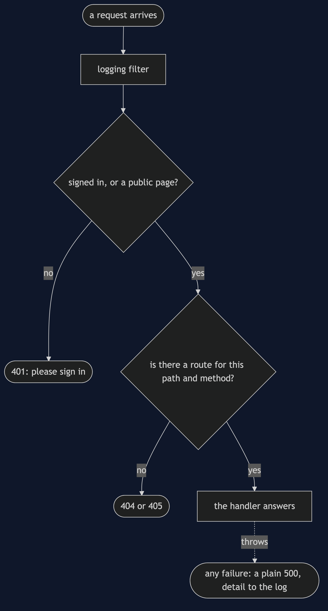
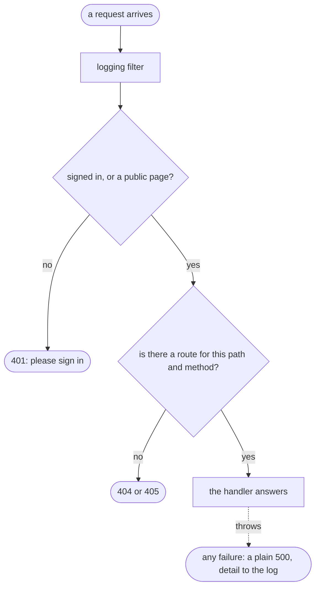

# Front Controller Pattern — Data Flow Diagram

What a request passes through.

Mermaid source

```mermaid
flowchart TD
    Req(["a request arrives"])
    Log["logging filter"]
    Auth{"signed in, or a public page?"}
    No(["401: please sign in"])
    Route{"is there a route for this path and method?"}
    Miss(["404 or 405"])
    H["the handler answers"]
    Err(["any failure: a plain 500, detail to the log"])
    Req --> Log --> Auth
    Auth -- no --> No
    Auth -- yes --> Route
    Route -- no --> Miss
    Route -- yes --> H
    H -. throws .-> Err
```

