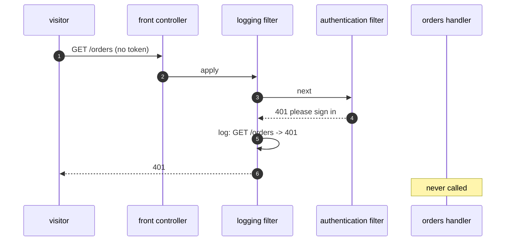

# Front Controller Pattern — Sequence Diagram

Written for a listener with the screen off.

Say it in words. A visitor asks for the orders page without a token. The request goes to the front controller. The logging filter passes it on. The authentication filter sees no token and the path is not public, so it answers four oh one without going further. The logging filter, on the way back, records the request and its outcome. The orders handler was never called.

Mermaid source

The load-bearing sentence: **a private page is protected without the handler knowing.**
