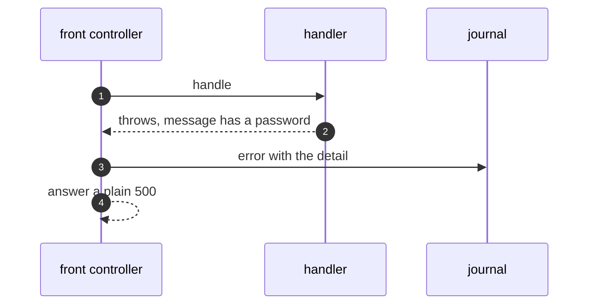

# Front Controller Pattern — UML Sequence Diagrams

Four sequences.

## 1. A Failure

Mermaid source

```mermaid
sequenceDiagram
    autonumber
    participant F as front controller
    participant H as handler
    participant J as journal
    F->>H: handle
    H-->>F: throws, message has a password
    F->>J: error with the detail
    F-->>F: answer a plain 500
```

