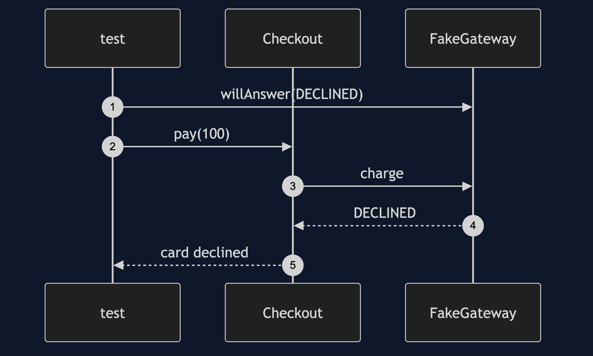

# Gateway Pattern

```
src/main/java/com/jk/explore/gateway/
├── GatewayDemo.java                 the six acts
├── PaymentGateway.java              the one door, in the shop's words
├── AcmeGateway.java                 the only class that knows Acme's fields and codes
├── BetaGateway.java                 the same door in front of another provider
├── FakeGateway.java                 never leaves the process
├── Checkout.java  PaymentResult.java  PaymentStatus.java
│
├── vendor/                          the providers' own clients
└── naive/
    └── NaiveCheckout.java            three features calling the client directly
```

**A gateway is one door to an outside system, in your own words, so it can be swapped and faked.**

This project is in [enterprise-design-patterns](..). It is the simple form of what [Anti-Corruption Layer](../../domain-driven-design-patterns/anti-corruption-layer-pattern) does for a whole foreign model, and the pattern behind every Spring `Template` and client wrapper.

## Run

```bash
./gradlew run
```

Six acts. Every number quoted below comes from this program's own output.

```
ONE. The provider's client, everywhere.
  checkout: paid, receipt AC-4999. renewal: renewed. gift card: topped up.
  three places build the provider's request fields and read its result codes. network calls made: 3.
  one of them forgot the currency field. nobody has noticed yet.
TWO. One door.
  the shop asks: paid, receipt AC-4999.
  the shop asks again: card declined.
  Checkout has no field name and no result code in it. it speaks approved, declined and unavailable.
THREE. Tests that never leave the process.
  paid, receipt FAKE-1; card declined; payment provider unavailable, try again.
  asked of the fake: 3 times. network calls made: 0.
  the fake can be told to decline, or to be down, on demand. a real provider cannot.
FOUR. One place for the network's habits.
  the provider times out once, then answers. the shop is told: paid, receipt AC-4999.
  network calls: 2. log: [acme timed out on attempt 1].
  timing out twice: payment provider unavailable, try again.
  the retry rule lives in one class. the three naive callers would each have needed their own.
FIVE. Another provider, the same shop.
  on Acme: paid, receipt AC-4999. on BetaPay: paid, receipt BP-4999.
  a large amount, on BetaPay: card declined.
  Checkout was not changed. it was given a different gateway.
SIX. The bill: what the door cannot say.
  Acme can hold a payment and capture part of it later. the gateway interface has one method, charge.
  to use partial capture, a method is added to the interface, and to all 3 gateways: Acme, BetaPay and the fake.
  and BetaPay cannot do it at all, so the interface must say what happens then.
```

## Test

```bash
./gradlew test
```

2 test classes, 8 test methods, offline, with nothing installed and no framework.

## Technologies and versions

| What | Version | Why it is here |
| --- | --- | --- |
| Java | 21 | The repository standard, via the Gradle toolchain block |
| Gradle | 9.2.1 | The wrapper in this directory; no separate install needed |
| JUnit 5 | 5.10.2 | Test runner |

No framework. A hand-built project stays plain Java so the mechanism is the whole lesson.

## Learning Material

| Document | What it covers |
| --- | --- |
| [`docs/problem-statement.md`](docs/problem-statement.md) | Who talks to the provider? |
| [`docs/gateway-pattern-explained.md`](docs/gateway-pattern-explained.md) | The pattern, and six acts |
| [`docs/class-diagram.md`](docs/class-diagram.md) | The types |
| [`docs/architecture-diagram.md`](docs/architecture-diagram.md) | The shop, one door, and the provider |
| [`docs/data-flow-diagram.md`](docs/data-flow-diagram.md) | How a charge crosses the door |
| [`docs/sequence-diagram.md`](docs/sequence-diagram.md) | Written for a listener with the screen off |
| [`docs/uml-diagram.md`](docs/uml-diagram.md) | Four sequences |
| [`docs/animation.html`](docs/animation.html) | The six acts in a browser |
| [`docs/prerequisites.md`](docs/prerequisites.md) | What you need to know |
| [`docs/session.md`](docs/session.md) | A one-hour taught session |
| [`docs/spec.md`](docs/spec.md) | The generated specification |
| [`docs/youtube.md`](docs/youtube.md) | Title, description and chapters |

### The pattern in one picture


### Where each piece sits


### How one request moves


### Who calls whom, in order


### All four sequences




### Video

Built from [`video/scenes.py`](video/scenes.py) by
[`video/build_video.sh`](video/build_video.sh). The rendered file is not
committed; see the repository README for why.

## Where you have already met this

Every payment, email, storage or search integration written by a careful team, and the reason Spring's `JavaMailSender` and `Repository` are interfaces.

## When this is too much

For a call made in one place to a system that will never change, a wrapper is one more class to read. It earns its place with several callers, or a need for a fake.

## Where this sits

This project is in [`enterprise-design-patterns`](..), and is meant to be read with its neighbours there.
