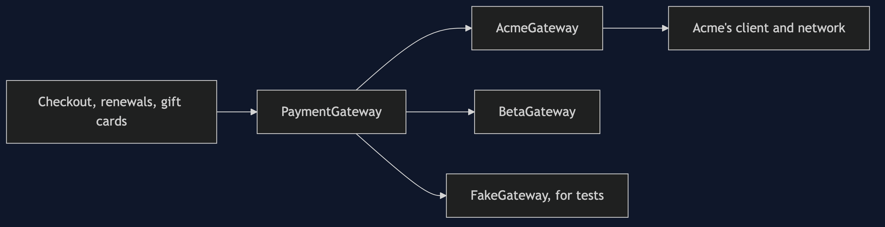
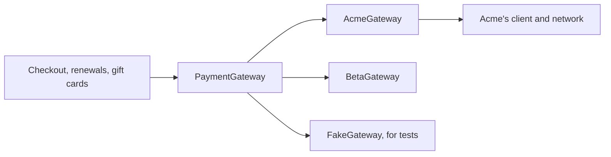

# Gateway Pattern — Architecture Diagram

The shop never sees the provider.

Mermaid source

```mermaid
flowchart LR
    S["Checkout, renewals, gift cards"] --> G["PaymentGateway"]
    G --> A["AcmeGateway"]
    G --> B["BetaGateway"]
    G --> F["FakeGateway, for tests"]
    A --> C["Acme's client and network"]
```

