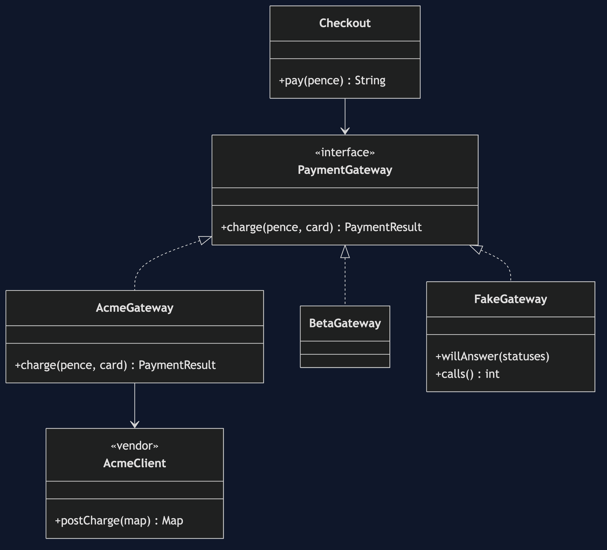
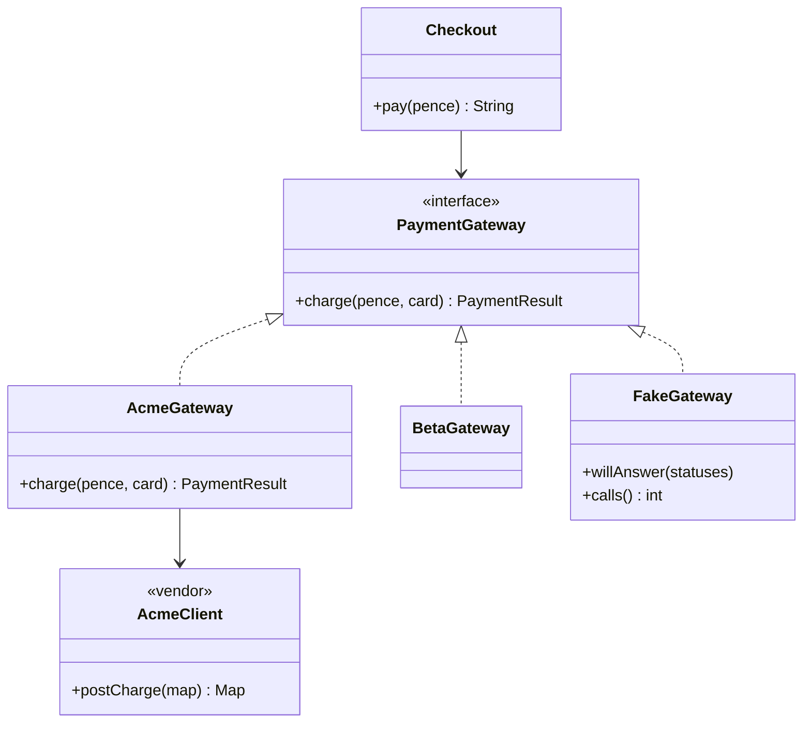

# Gateway Pattern — Class Diagram

The shop depends on an interface. Each gateway knows one provider.

Mermaid source

```mermaid
classDiagram
    class Checkout {
        +pay(pence) String
    }
    class PaymentGateway {
        <<interface>>
        +charge(pence, card) PaymentResult
    }
    class AcmeGateway {
        +charge(pence, card) PaymentResult
    }
    class BetaGateway
    class FakeGateway {
        +willAnswer(statuses)
        +calls() int
    }
    class AcmeClient {
        <<vendor>>
        +postCharge(map) Map
    }
    Checkout --> PaymentGateway
    PaymentGateway <|.. AcmeGateway
    PaymentGateway <|.. BetaGateway
    PaymentGateway <|.. FakeGateway
    AcmeGateway --> AcmeClient
```

