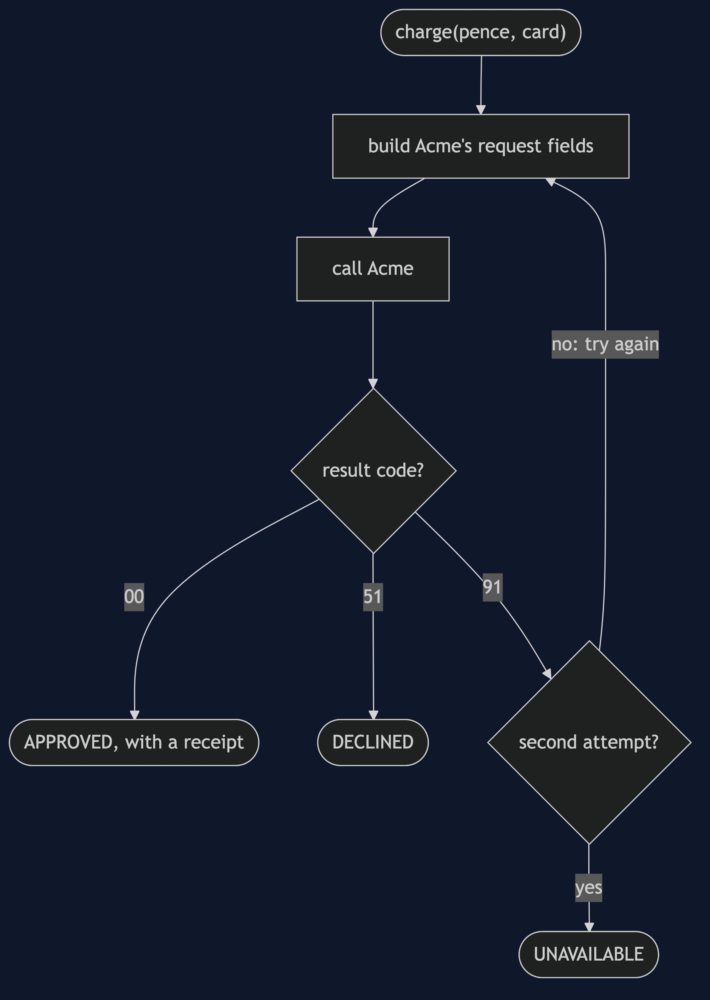
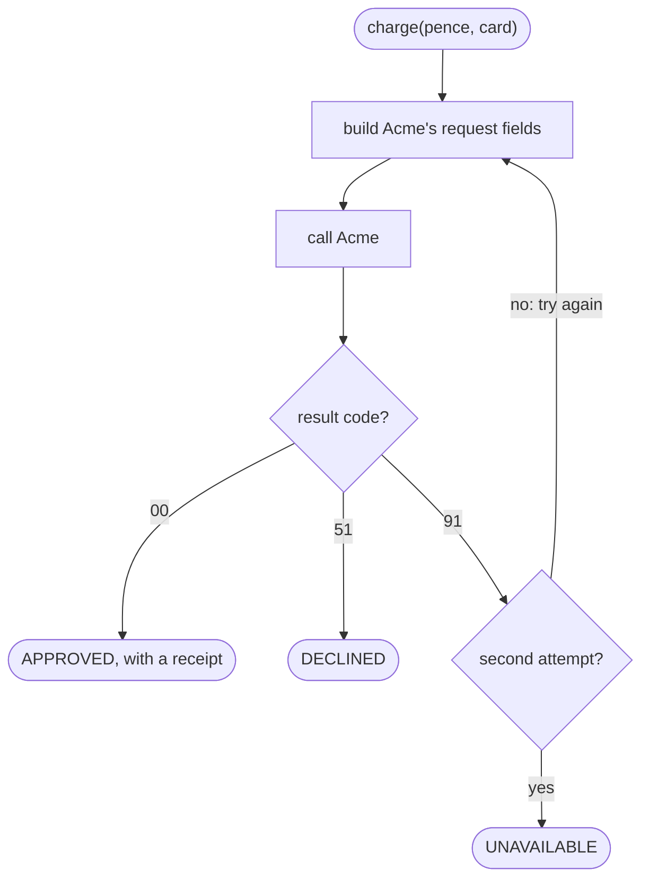

# Gateway Pattern — Data Flow Diagram

What the Acme gateway does with a charge.

Mermaid source

```mermaid
flowchart TD
    Ask(["charge(pence, card)"])
    Build["build Acme's request fields"]
    Call["call Acme"]
    Code{"result code?"}
    Ok(["APPROVED, with a receipt"])
    No(["DECLINED"])
    Time{"second attempt?"}
    Un(["UNAVAILABLE"])
    Ask --> Build --> Call --> Code
    Code -- 00 --> Ok
    Code -- 51 --> No
    Code -- 91 --> Time
    Time -- no: try again --> Build
    Time -- yes --> Un
```

