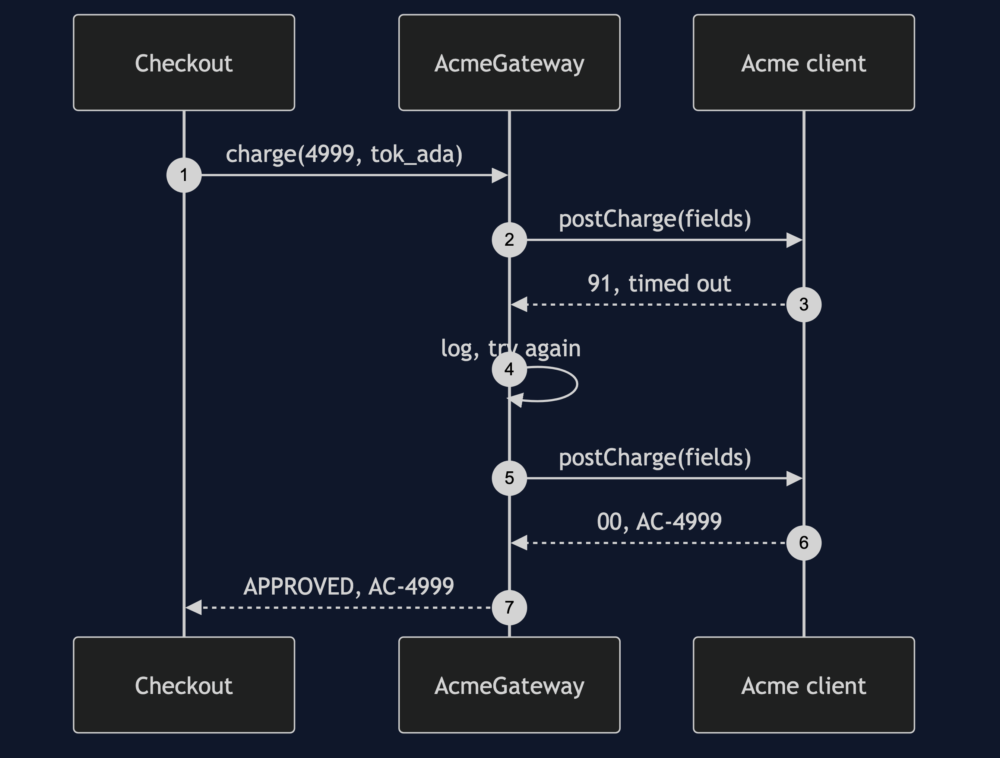
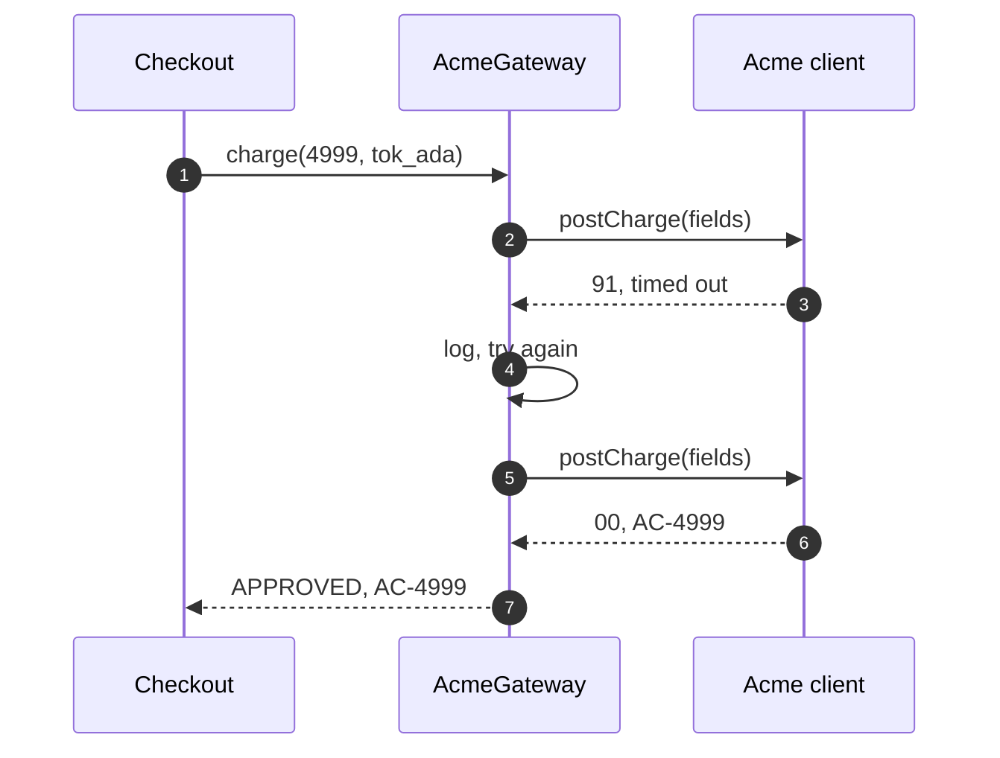

# Gateway Pattern — Sequence Diagram

Written for a listener with the screen off.

Say it in words. Checkout asks the gateway to charge forty nine ninety nine. The Acme gateway builds the provider's request, with the amount in minor units, the currency and the card token. It calls the provider, which times out. The gateway logs it and tries once more. The provider answers with code zero zero and a reference. The gateway turns that into an approved result with a receipt, and checkout writes paid.

Mermaid source

The load-bearing sentence: **checkout never sees a field name or a code.**
