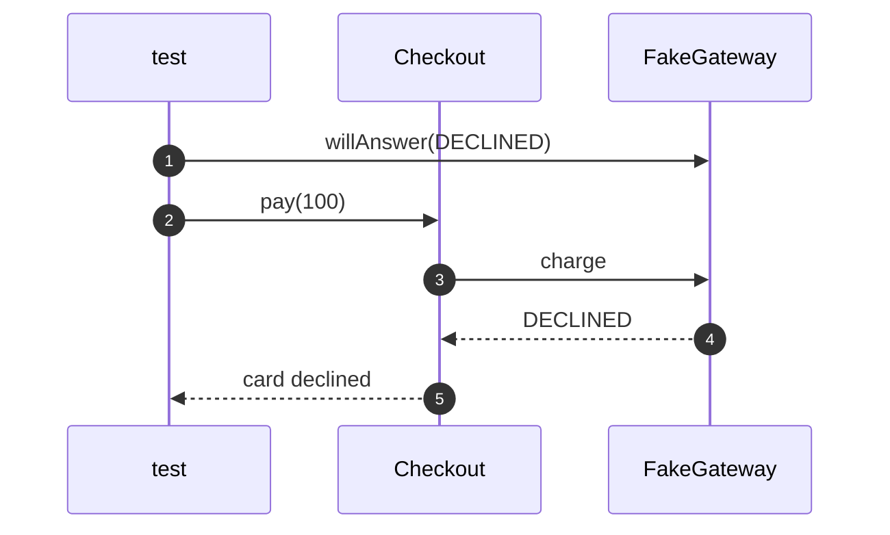

# Gateway Pattern — UML Sequence Diagrams

Four sequences.

## 1. A Test With A Fake

Mermaid source

```mermaid
sequenceDiagram
    autonumber
    participant T as test
    participant C as Checkout
    participant F as FakeGateway
    T->>F: willAnswer(DECLINED)
    T->>C: pay(100)
    C->>F: charge
    F-->>C: DECLINED
    C-->>T: card declined
```

