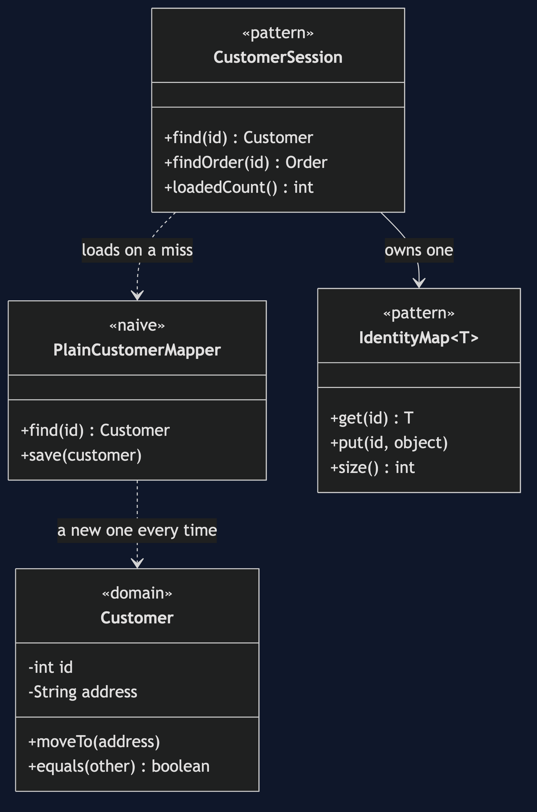
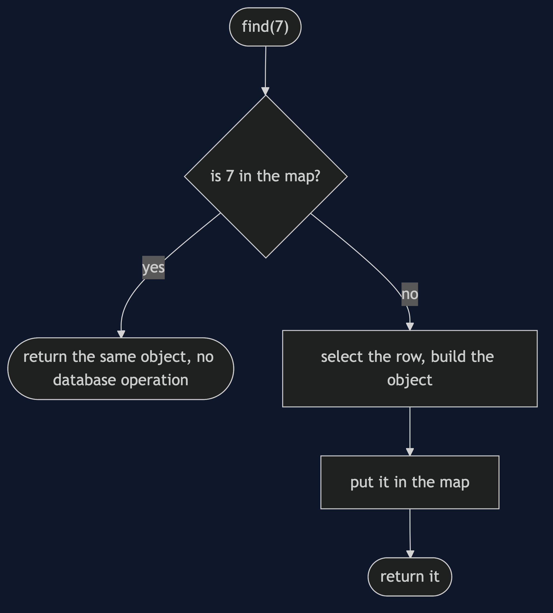
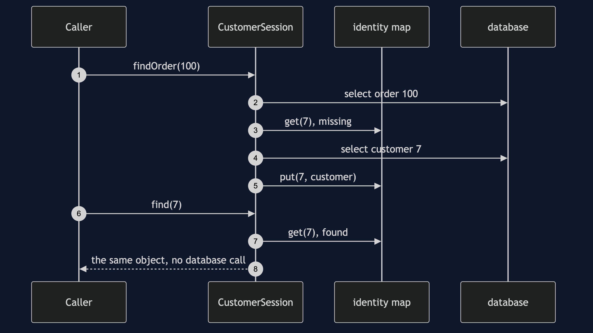

# Identity Map Pattern

```
src/main/java/com/jk/explore/identitymap/
├── CustomerSessionDemo.java         composition root — the six acts
│
├── toydb/                           ← the category's toy database, copied
│   ├── Database.java
│   ├── Table.java
│   └── Row.java
├── domain/
│   ├── Customer.java                 mutable, equals() compares ids
│   └── Order.java
├── naive/
│   └── PlainCustomerMapper.java      a new object every time it is asked
│
└── pattern/                         ← the real thing
    ├── IdentityMap.java              id to the one loaded object
    └── CustomerSession.java          a session that owns one map
```

**A map, scoped to the session, from id to the one loaded object: ask for customer 7 twice and get the same object both times.**

This is the second project in [enterprise-design-patterns](..). It solves a problem [Data Mapper](../data-mapper-pattern) creates: once objects and rows are separate, the same row can become two objects.

## Run

```bash
./gradlew run
```

Six acts. Every operation against the toy database is counted, and every count quoted below comes from that counter.

```
IDENTITY MAP — the same customer, twice

ONE. Two loads, two objects.
  the order's customer, and customer 7 loaded by id:
  same object (==): false
  3 selects: the order, its customer, and the same customer again.

TWO. The lost change.
  one object moved her to York. the other changed her email. both saved.
  stored address: 12 Mill Lane, Leeds
  stored email:   ada@newmail.example
  the address change silently disappeared: last writer wins.

THREE. equals() is not enough.
  equals: true, same object: false
  one moved to 1 High Street, York, the other still says 12 Mill Lane, Leeds
  equal, and still separately changeable.

FOUR. The pattern — one map, one object.
  the order's customer and customer 7 by id, same object (==): true
  2 selects: the order's row, and the customer once.
  two more finds of customer 7 cost 0 operations.

FIVE. The map is a cache, so it can be stale.
  another process changed the email in the database.
  this session still sees: ada@example.com
  a new session sees:      ada@other.example
  same object still: true

SIX. It holds references, and its scope is a decision.
  a bulk load of 1000 customers: the session now holds 1000 objects.
  per request, per session, or per application: each is wrong in a different way.
  where you have met this: the JPA persistence context is an identity map.
```

## Test

```bash
./gradlew test
```

4 test classes, 13 test methods, offline, with no database installed.

## Technologies and versions

| What | Version | Why it is here |
| --- | --- | --- |
| Java | 21 | The repository standard, via the Gradle toolchain block |
| Gradle | 9.2.1 | The wrapper in this directory; no separate install needed |
| JUnit 5 | 5.10.2 | Test runner |

No framework. A hand-built project stays plain Java so the mechanism is the whole lesson.

## Learning Material

| Document | What it covers |
| --- | --- |
| [`docs/problem-statement.md`](docs/problem-statement.md) | The customer, two objects, and the lost change |
| [`docs/identity-map-pattern-explained.md`](docs/identity-map-pattern-explained.md) | The pattern, its costs, and where you have met it |
| [`docs/class-diagram.md`](docs/class-diagram.md) | The types |
| [`docs/architecture-diagram.md`](docs/architecture-diagram.md) | Every route to one map |
| [`docs/data-flow-diagram.md`](docs/data-flow-diagram.md) | One find, hit or miss |
| [`docs/sequence-diagram.md`](docs/sequence-diagram.md) | Written for a listener with the screen off |
| [`docs/uml-diagram.md`](docs/uml-diagram.md) | Four sequences |
| [`docs/animation.html`](docs/animation.html) | The six acts in a browser |
| [`docs/prerequisites.md`](docs/prerequisites.md) | What you need to know |
| [`docs/session.md`](docs/session.md) | A one-hour taught session |
| [`docs/spec.md`](docs/spec.md) | The generated specification |
| [`docs/youtube.md`](docs/youtube.md) | Title, description and chapters |

### The pattern in one picture



### Where each piece sits


### How one request moves



### Who calls whom, in order



### All four sequences


### Video

Built from [`video/scenes.py`](video/scenes.py) by
[`video/build_video.sh`](video/build_video.sh). The rendered file is not
committed; see the repository README for why.

## Where you have already met this

The JPA persistence context is an identity map. Load the same entity twice inside one transaction and `==` is true.

## When this is too much

A request that loads a customer once gains nothing from a map. It earns its place when the same row can be reached by two routes.

## Where this sits

This is the second project in [`enterprise-design-patterns`](..), after [Data Mapper](../data-mapper-pattern).
