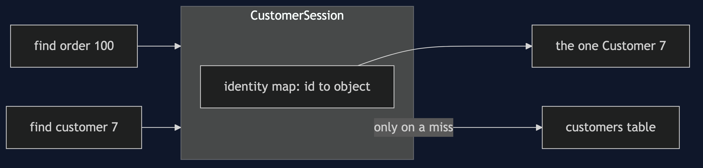
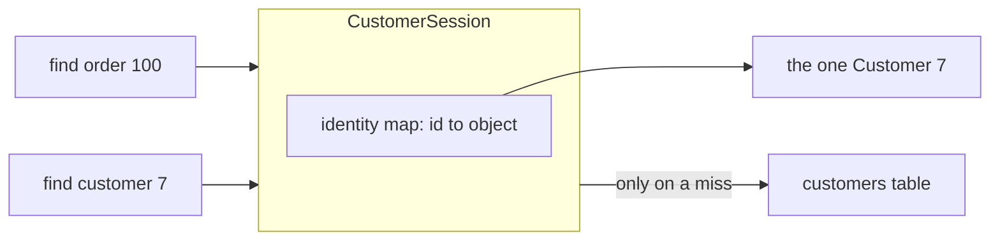

# Identity Map Pattern — Architecture Diagram

Every route to customer 7 goes through one map.

Mermaid source

```mermaid
flowchart LR
    A["find order 100"] --> S
    B["find customer 7"] --> S
    subgraph S["CustomerSession"]
        M["identity map: id to object"]
    end
    S -->|only on a miss| DB["customers table"]
    M --> O["the one Customer 7"]
```

