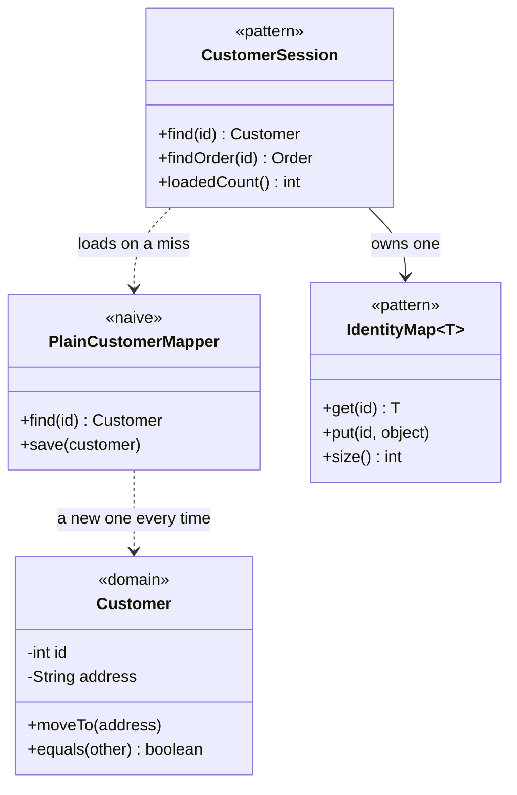

# Identity Map Pattern — Class Diagram

`CustomerSession` is the only class that owns an `IdentityMap`. The naive mapper has none.

Mermaid source

```mermaid
classDiagram
    class Customer {
        <<domain>>
        -int id
        -String address
        +moveTo(address)
        +equals(other) boolean
    }
    class PlainCustomerMapper {
        <<naive>>
        +find(id) Customer
        +save(customer)
    }
    class IdentityMap~T~ {
        <<pattern>>
        +get(id) T
        +put(id, object)
        +size() int
    }
    class CustomerSession {
        <<pattern>>
        +find(id) Customer
        +findOrder(id) Order
        +loadedCount() int
    }
    CustomerSession --> IdentityMap : owns one
    CustomerSession ..> PlainCustomerMapper : loads on a miss
    PlainCustomerMapper ..> Customer : a new one every time
```

