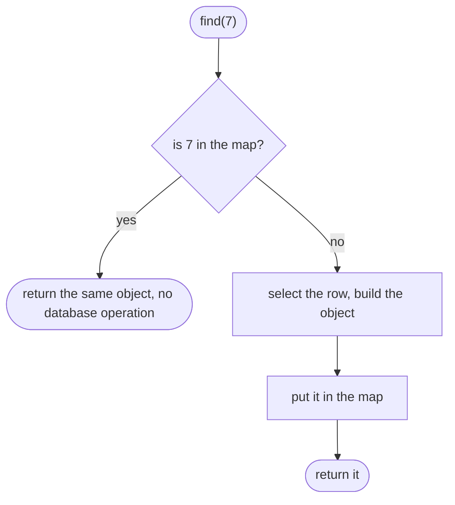

# Identity Map Pattern — Data Flow Diagram

One `find`, from an id to an object.

Mermaid source

```mermaid
flowchart TD
    Ask(["find(7)"])
    Hit{"is 7 in the map?"}
    Ret(["return the same object, no database operation"])
    Load["select the row, build the object"]
    Put["put it in the map"]
    Out(["return it"])
    Ask --> Hit
    Hit -- yes --> Ret
    Hit -- no --> Load --> Put --> Out
```

