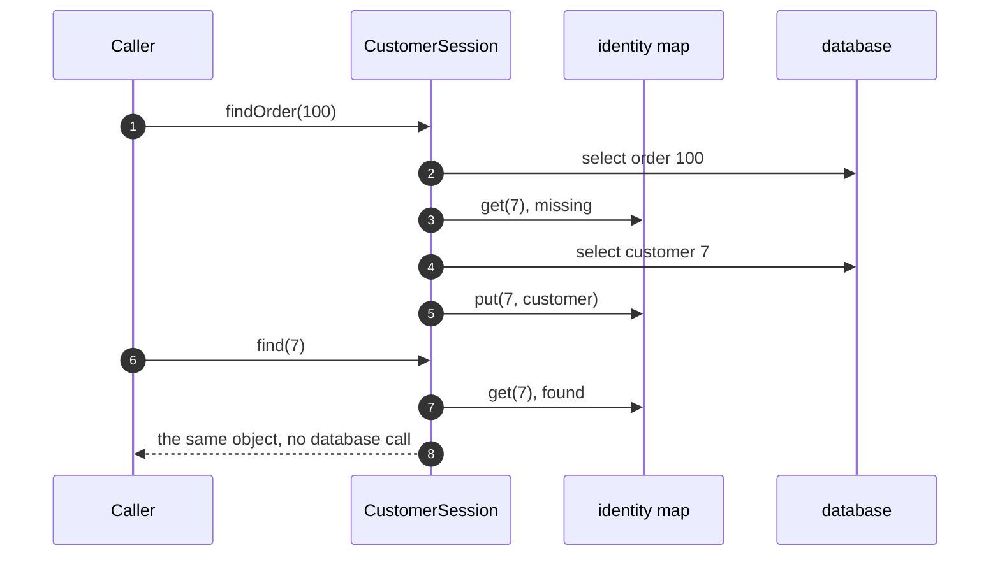

# Identity Map Pattern — Sequence Diagram

Written for a listener with the screen off.

Say it in words. The caller asks the session for the order. The session reads the order row, then asks itself for customer seven. It is not in the map, so it reads the customer row, builds the customer and stores it in the map. Later the caller asks for customer seven directly. This time it is in the map, so the session returns the same object with no database call at all.

Mermaid source

The load-bearing sentence: **the second ask cost nothing, and returned the very same object.**
