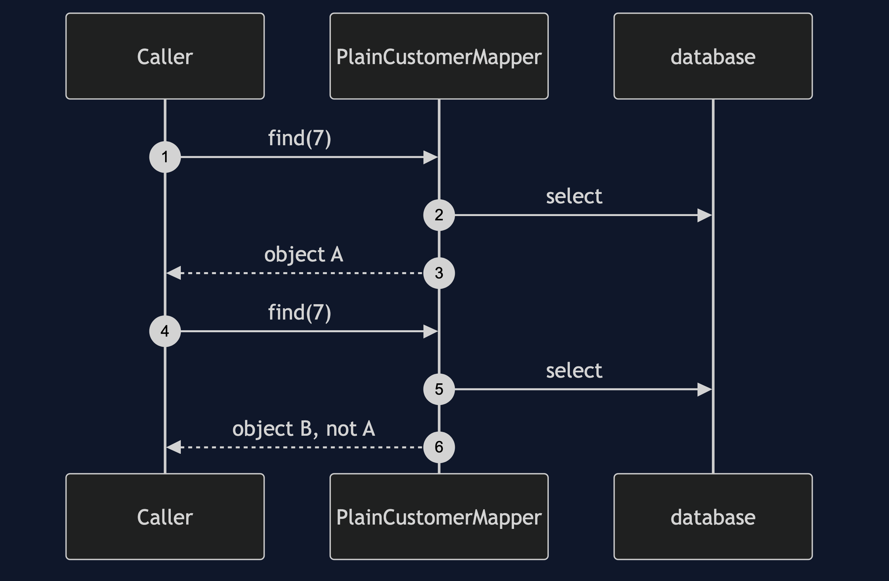
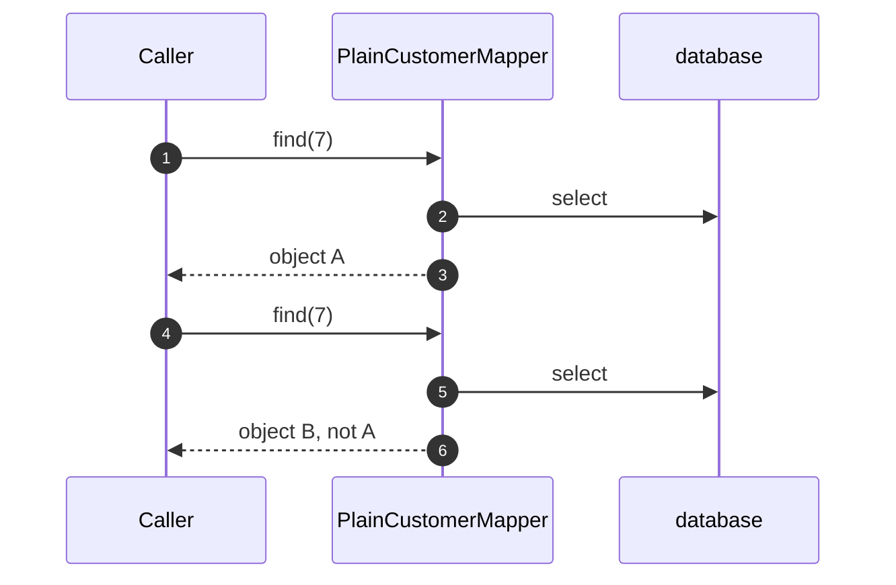
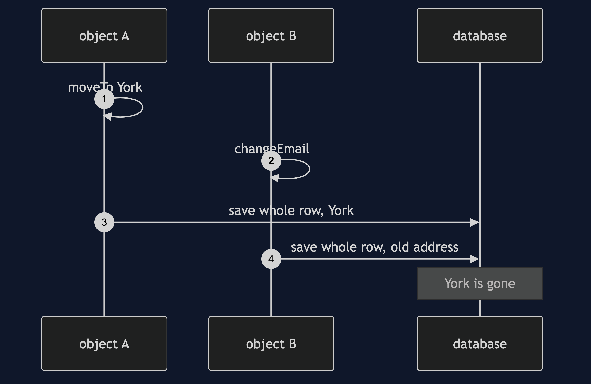
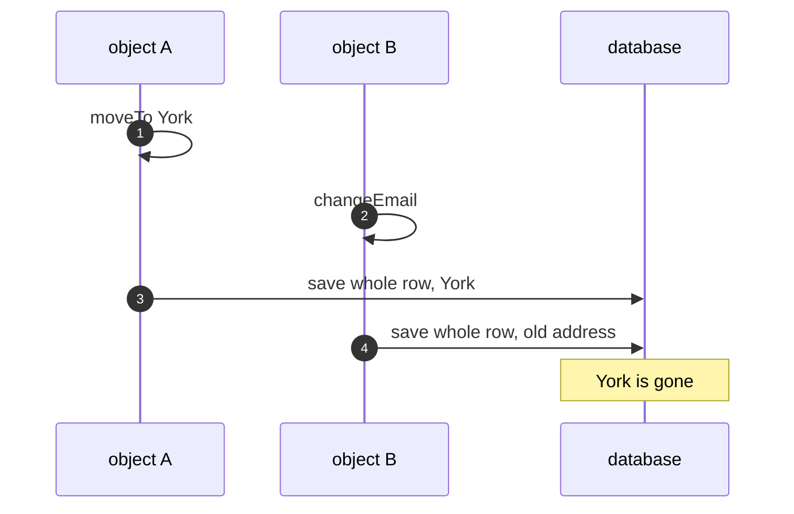
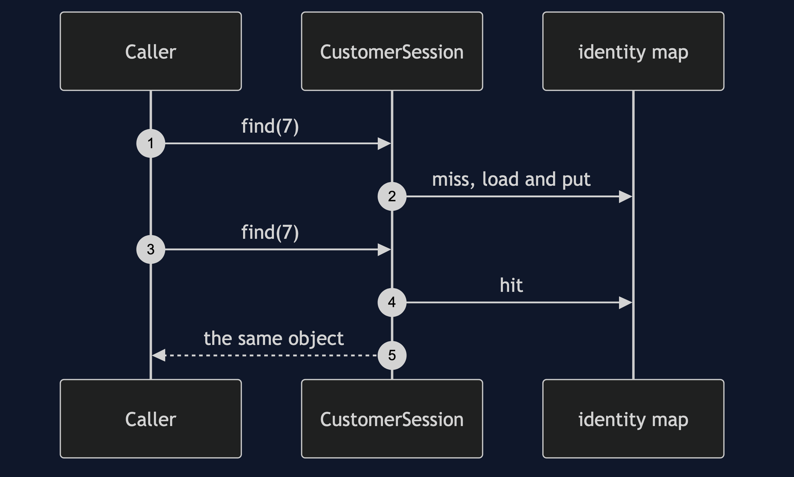
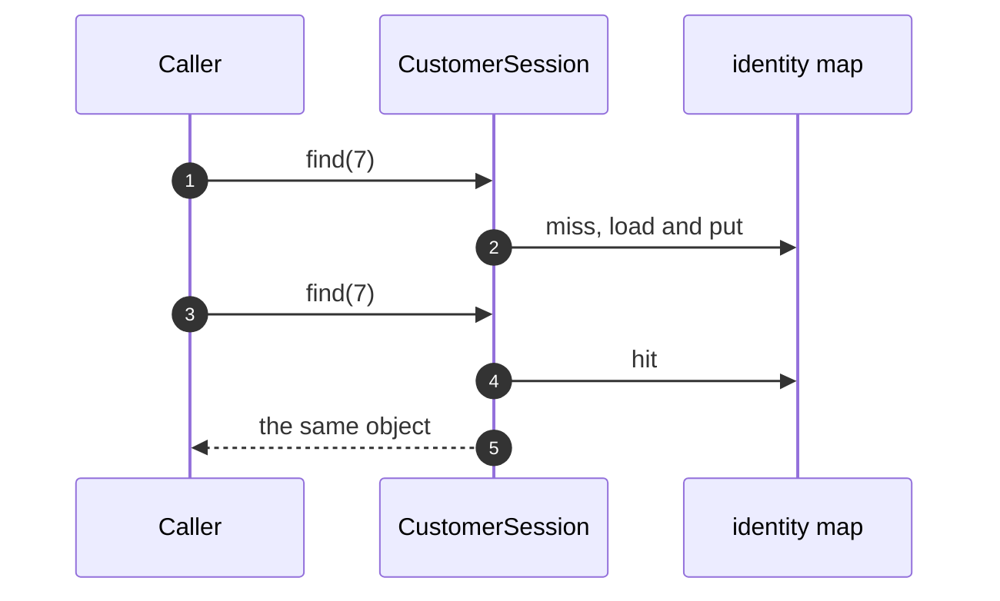
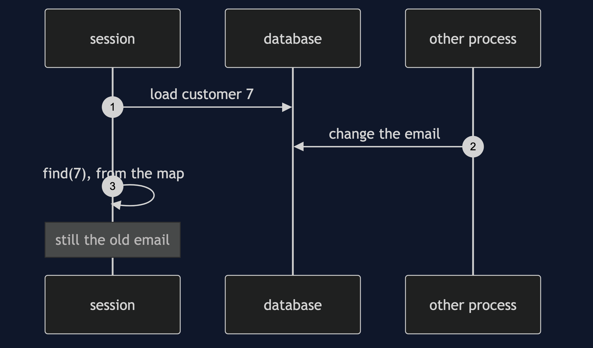
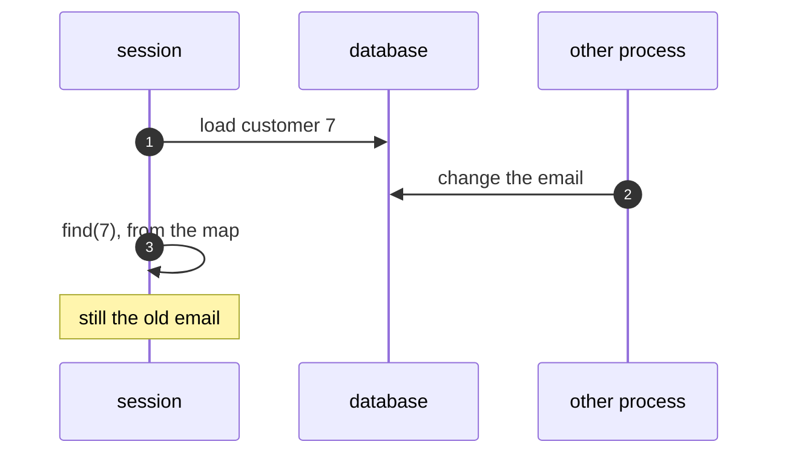

# Identity Map Pattern — UML Sequence Diagrams

Four sequences.

## 1. Two Loads, Two Objects

Mermaid source

## 2. The Lost Change

Mermaid source

## 3. One Map, One Object

Mermaid source

## 4. A Stale Session

Mermaid source

