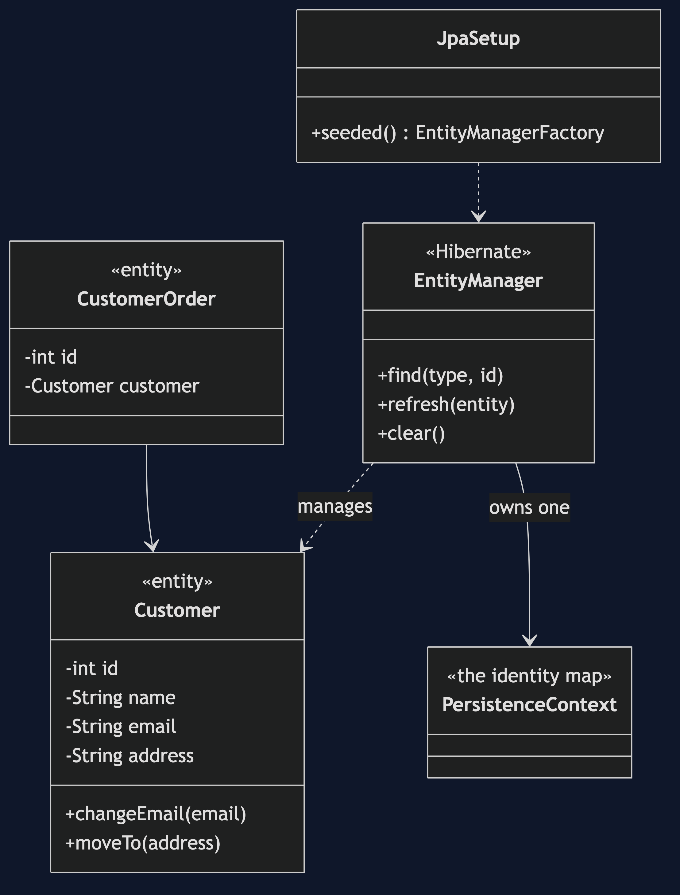
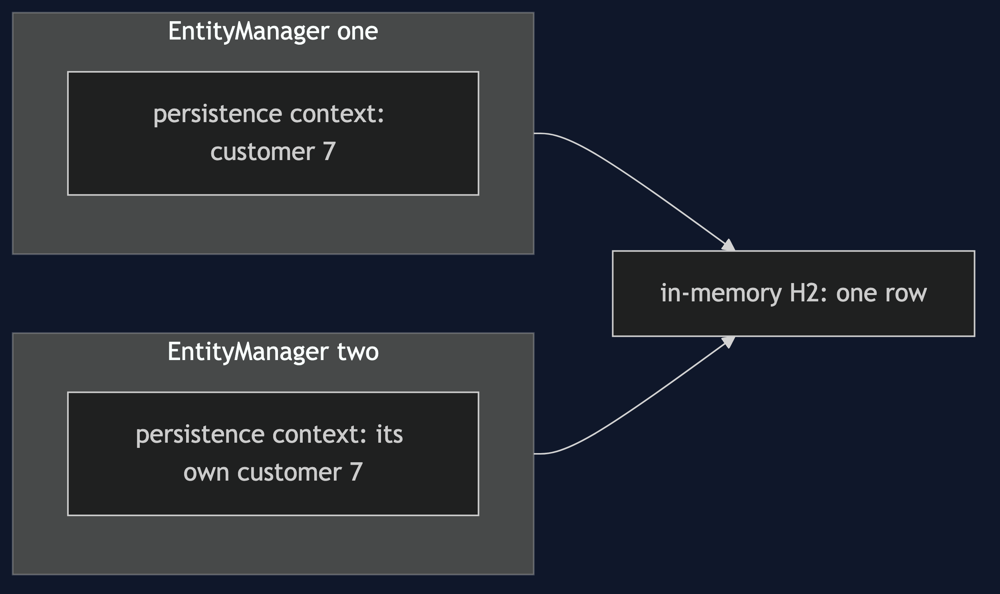
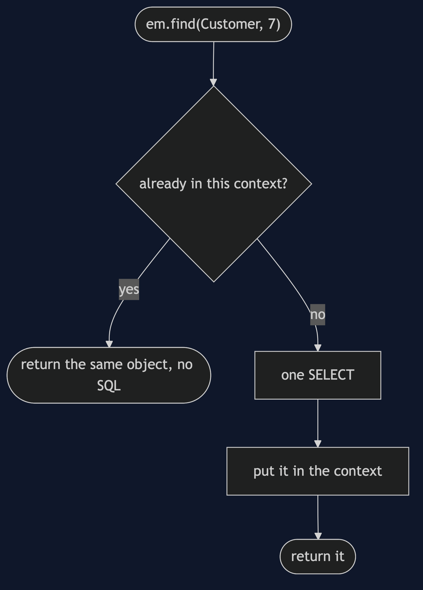
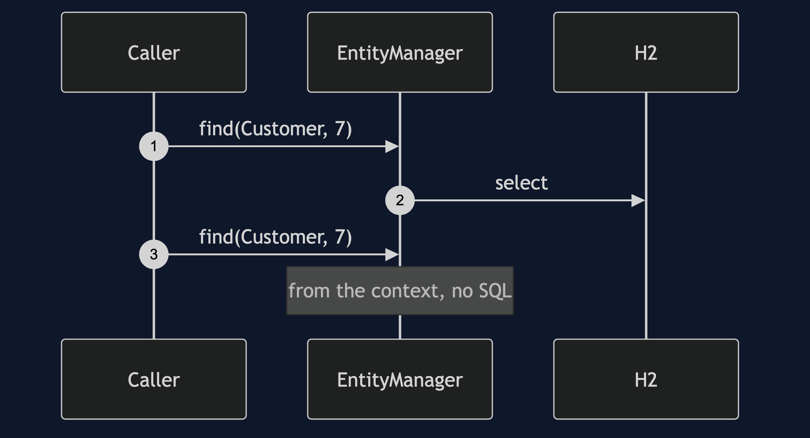
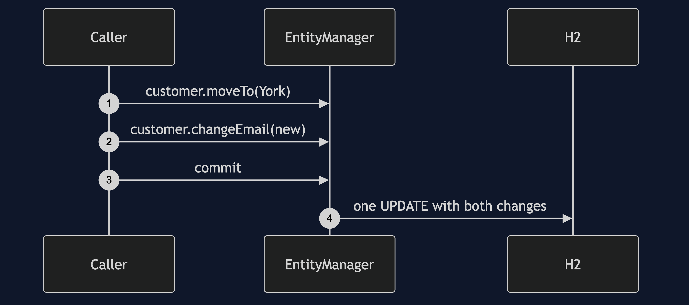
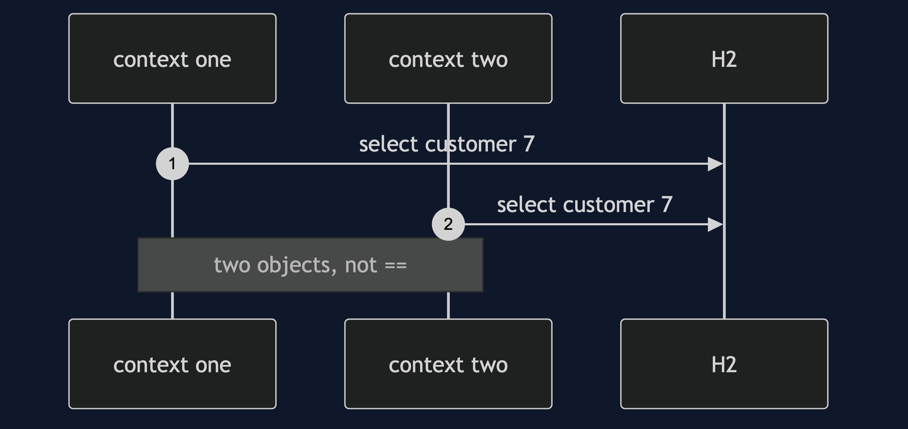
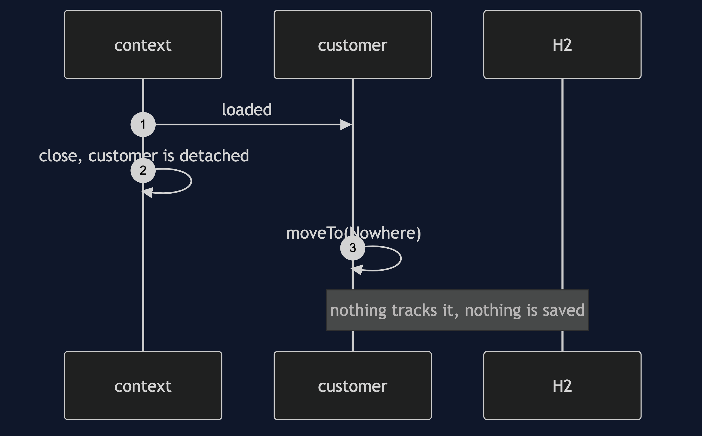

# Identity Map with JPA Pattern

```
src/main/java/com/jk/explore/identitymapjpa/
├── CustomerJpaDemo.java             composition root — the six acts
├── JpaSetup.java                    builds an EntityManagerFactory over in-memory H2, seeds customer 7
│
└── domain/
    ├── Customer.java                 the partner's customer, plus @Entity and @Id
    └── CustomerOrder.java            the partner's order, plus @Entity and @ManyToOne
```

**The JPA persistence context is an identity map: load the same customer twice in one context and get the same object.**

This project is the framework version of [Identity Map](../identity-map-pattern). That project built the mechanism by hand; this one shows the same customer 7 and order 100 inside JPA, where you did not write the map. It does not re-teach the pattern. It shows the one thing that is new: `first == second` being true, and then two contexts making it false again.

## Run

```bash
./gradlew run
```

Six acts. The partner project, Identity Map, built this mechanism by hand. Every SQL count below comes from Hibernate's own statistics.

```
IDENTITY MAP WITH JPA — the persistence context is the map

ONE. Load the same customer twice in one persistence context.
  first == second: true
  SQL statements issued: 1
  this is the identity map from the last project, and you did not write it.

TWO. The order's customer and customer 7 by id.
  the order's customer == customer 7 by id: true
  SQL statements issued: 1 (the order and its customer, once)

THREE. Two changes to one customer are both kept.
  one object moved her and changed her email. SQL statements at commit: 1 (one UPDATE)
  stored address: 1 High Street, York
  stored email:   ada@newmail.example
  nothing lost: there was only ever one object.

FOUR. Two persistence contexts — two objects again.
  customer 7 from context one == from context two: false
  equals: true. same customer, two objects, and each is free to disagree.
  both contexts are now closed. the objects are detached.
  a detached customer was changed. stored address is still: 12 Mill Lane, Leeds
  nothing tracks a detached object. the change is silently not saved.

FIVE. The context is a cache, so it can be stale.
  another context committed a new email.
  this context still sees: ada@example.com
  after refresh it sees:   ada@other.example

SIX. It holds references, and its scope is a decision.
  after loading 1000 customers, the context holds 1000 entities.
  after clear(): 0.
  in a Spring application, the context normally lives for one transaction or one request.
```

## Test

```bash
./gradlew test
```

2 test classes, 8 test methods, offline, over an in-memory H2 database that needs no installation.

## Technologies and versions

| What | Version | Why it is here |
| --- | --- | --- |
| Java | 21 | The repository standard, via the Gradle toolchain block |
| Gradle | 9.2.1 | The wrapper in this directory; no separate install needed |
| Hibernate ORM | 7.4.5.Final | The JPA implementation. It is what is being explained |
| H2 | 2.4.240 | An in-memory database that starts inside the test, so nothing is installed |
| Jakarta Persistence API | 3.2.0 | The `EntityManager` and annotations |
| JUnit 5 | 5.10.2 | Test runner |

Hibernate and H2 versions come from Spring Boot 4.1.1's bill of materials, so they are the versions that release was tested with. Spring Boot itself is not a dependency here. See [`docs/dependencies.md`](docs/dependencies.md).

## Learning Material

| Document | What it covers |
| --- | --- |
| [`docs/problem-statement.md`](docs/problem-statement.md) | The partner's scenario, and what is new |
| [`docs/identity-map-with-jpa-pattern-explained.md`](docs/identity-map-with-jpa-pattern-explained.md) | What JPA adds, and the detached-entity failure |
| [`docs/class-diagram.md`](docs/class-diagram.md) | The types |
| [`docs/architecture-diagram.md`](docs/architecture-diagram.md) | Two contexts over one database |
| [`docs/data-flow-diagram.md`](docs/data-flow-diagram.md) | One find, from the context or the database |
| [`docs/sequence-diagram.md`](docs/sequence-diagram.md) | Written for a listener with the screen off |
| [`docs/uml-diagram.md`](docs/uml-diagram.md) | Four sequences |
| [`docs/animation.html`](docs/animation.html) | The six acts in a browser |
| [`docs/prerequisites.md`](docs/prerequisites.md) | What you need to know |
| [`docs/session.md`](docs/session.md) | A one-hour taught session |
| [`docs/spec.md`](docs/spec.md) | The generated specification |
| [`docs/youtube.md`](docs/youtube.md) | Title, description and chapters |
| [`docs/dependencies.md`](docs/dependencies.md) | What Hibernate and H2 are, what they cost, and that skipping this project loses none of the pattern |

### The pattern in one picture



### Where each piece sits



### How one request moves



### Who calls whom, in order


### All four sequences









### Video

Built from [`video/scenes.py`](video/scenes.py) by
[`video/build_video.sh`](video/build_video.sh). The rendered file is not
committed; see the repository README for why.

## Where you have already met this

This is where you have already met it. Every JPA developer has used an identity map without knowing. If a second `find` ever did not hit the database, this was the reason.

## When this is too much

If you use JPA you already have it and cannot turn it off. The lesson is knowing it is there.

## Where this sits

This project pairs with [Identity Map](../identity-map-pattern), and is the first of four framework projects in [`enterprise-design-patterns`](..).
