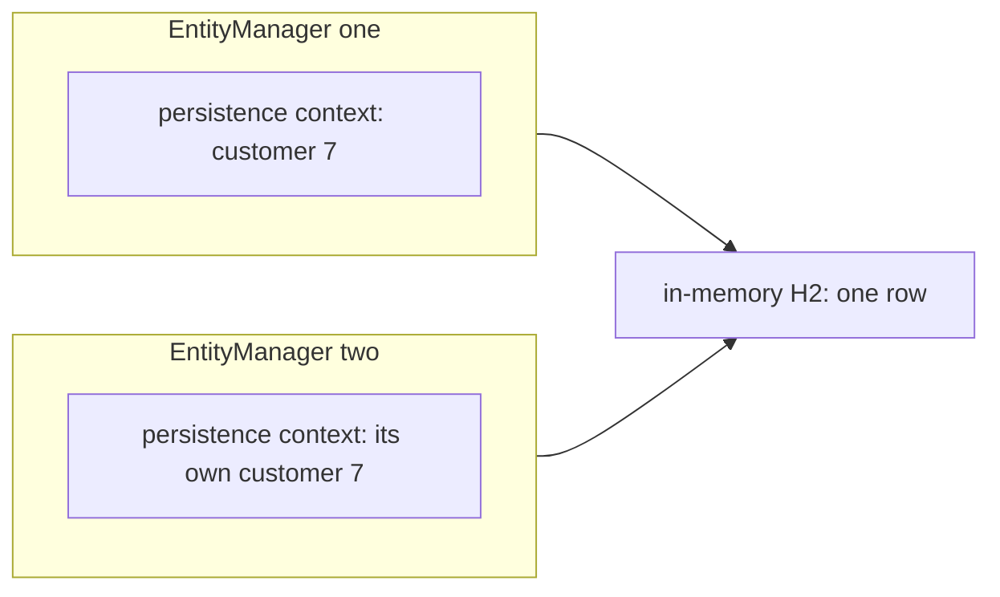

# Identity Map with JPA Pattern — Architecture Diagram

One persistence context per EntityManager, all over one database.

Mermaid source

```mermaid
flowchart LR
    subgraph One["EntityManager one"]
        C1["persistence context: customer 7"]
    end
    subgraph Two["EntityManager two"]
        C2["persistence context: its own customer 7"]
    end
    One --> DB["in-memory H2: one row"]
    Two --> DB
```

