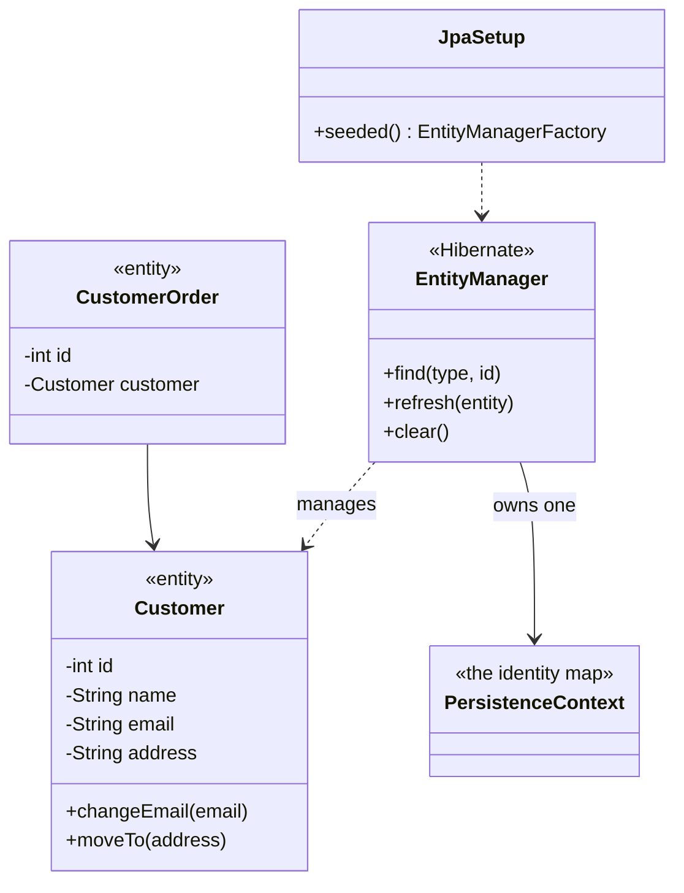

# Identity Map with JPA Pattern — Class Diagram

Two annotations turn the partner's classes into entities. Everything else is Hibernate.

Mermaid source

```mermaid
classDiagram
    class Customer {
        <<entity>>
        -int id
        -String name
        -String email
        -String address
        +changeEmail(email)
        +moveTo(address)
    }
    class CustomerOrder {
        <<entity>>
        -int id
        -Customer customer
    }
    class EntityManager {
        <<Hibernate>>
        +find(type, id)
        +refresh(entity)
        +clear()
    }
    class PersistenceContext {
        <<the identity map>>
    }
    class JpaSetup {
        +seeded() EntityManagerFactory
    }
    CustomerOrder --> Customer
    EntityManager --> PersistenceContext : owns one
    EntityManager ..> Customer : manages
    JpaSetup ..> EntityManager
```

