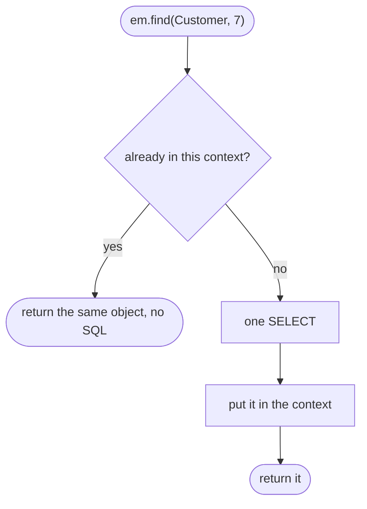

# Identity Map with JPA Pattern — Data Flow Diagram

One `find`: from the context, or from the database.

Mermaid source

```mermaid
flowchart TD
    Ask(["em.find(Customer, 7)"])
    Has{"already in this context?"}
    Same(["return the same object, no SQL"])
    Select["one SELECT"]
    Put["put it in the context"]
    Out(["return it"])
    Ask --> Has
    Has -- yes --> Same
    Has -- no --> Select --> Put --> Out
```

