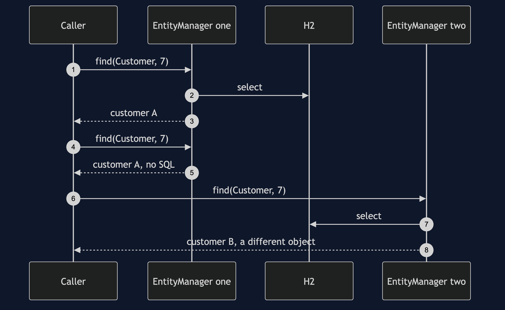
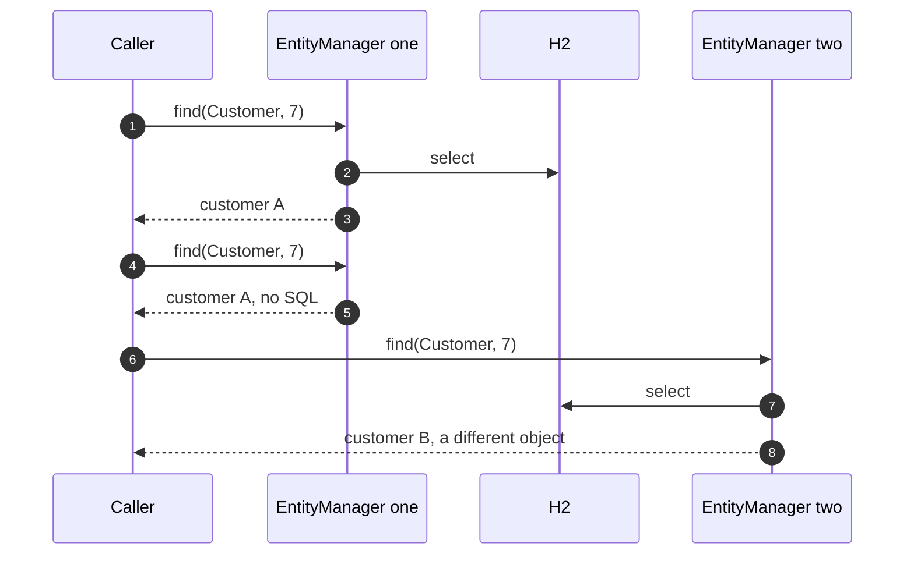

# Identity Map with JPA Pattern — Sequence Diagram

Written for a listener with the screen off.

Say it in words. The caller asks the entity manager for customer seven. The persistence context has nothing yet, so Hibernate runs one select and keeps the customer in the context. The caller asks again. This time the context already has it, so the same object comes back with no SQL at all. If a second entity manager is asked, it has its own, empty context, so it runs its own select and builds its own, different object.

Mermaid source

The load-bearing sentence: **the map belongs to one entity manager, so two of them give two objects.**
