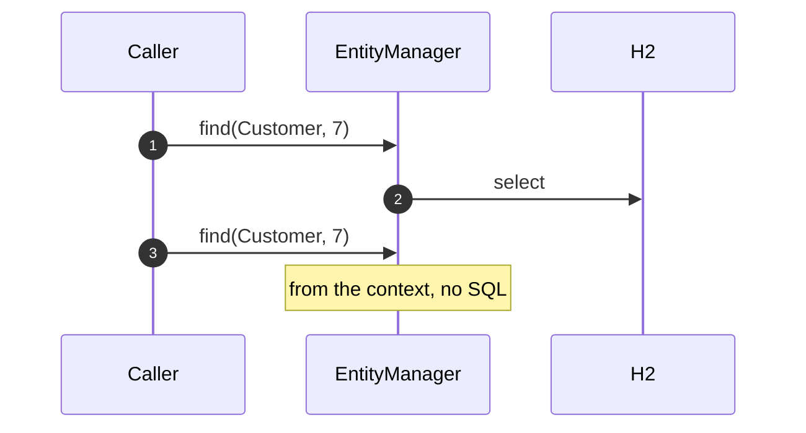
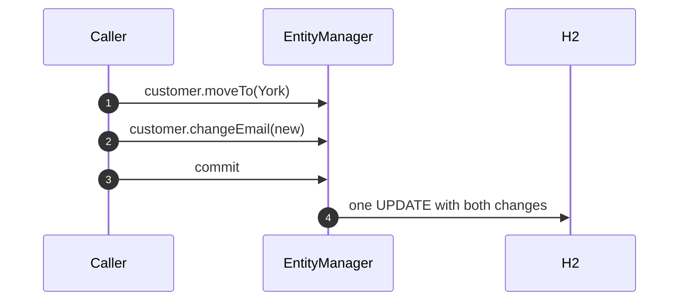
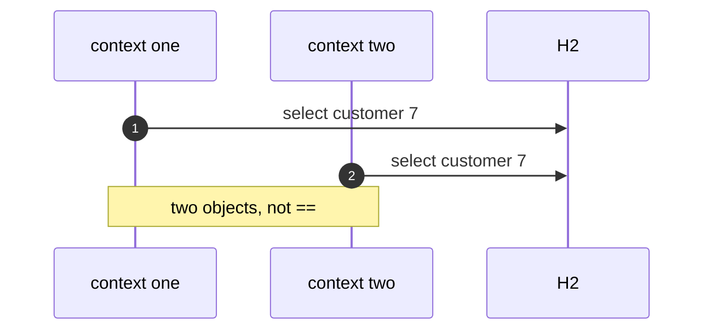
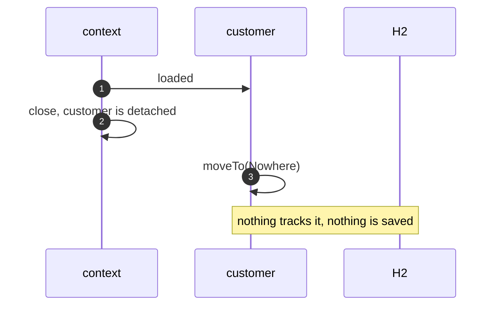

# Identity Map with JPA Pattern — UML Sequence Diagrams

Four sequences.

## 1. Two Finds, One Context

Mermaid source

## 2. Two Changes, One Update

Mermaid source

## 3. Two Contexts

Mermaid source

## 4. A Detached Change

Mermaid source

