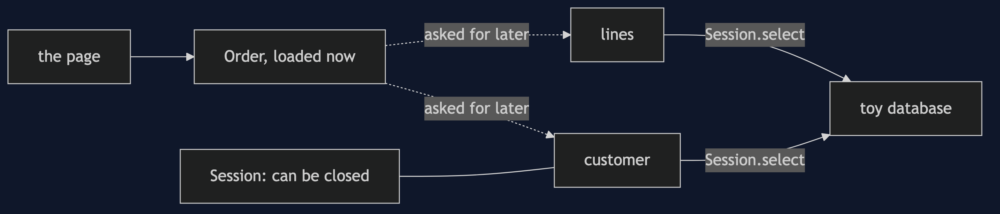
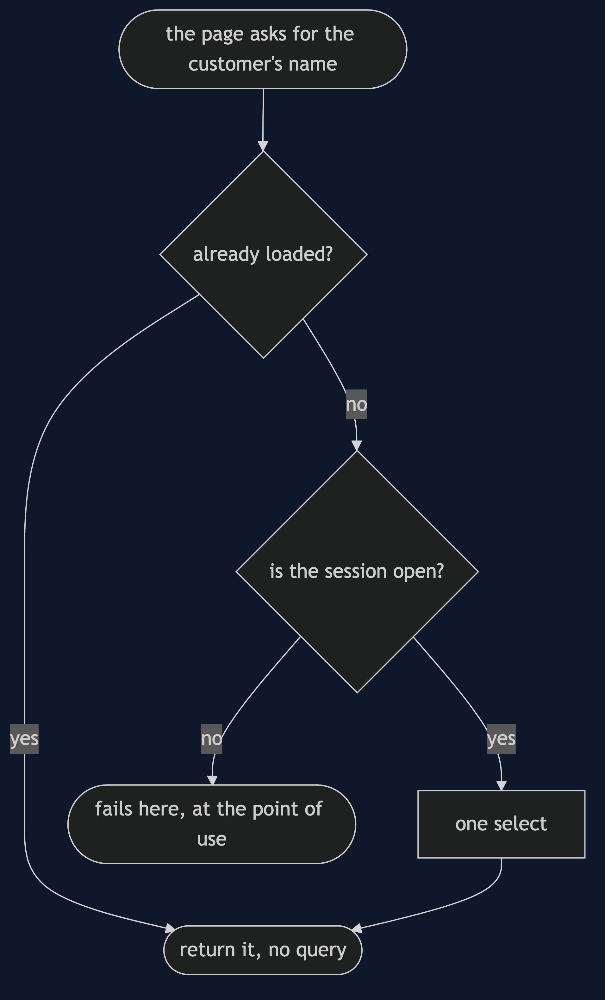
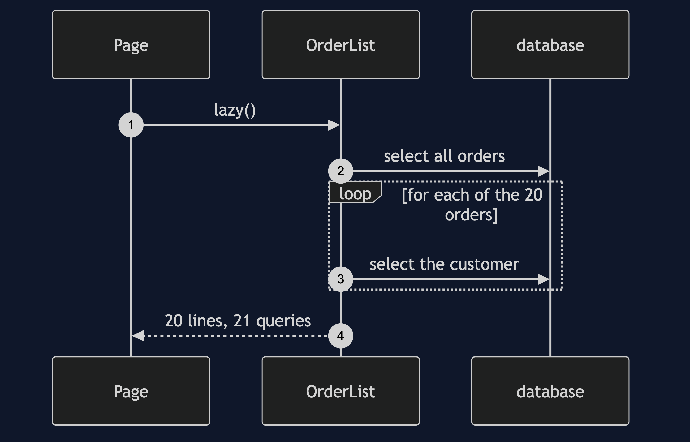

# Lazy Load Pattern

```
src/main/java/com/jk/explore/lazyload/
├── LazyLoadDemo.java                composition root — the six acts
│
├── toydb/                           ← the toy database, with a read that can fail
├── domain/
│   └── Shop.java                     5 customers, 20 orders, 80 lines, 12 products, 4 categories
├── naive/
│   └── EagerOrderLoader.java         everything reachable, immediately
│
└── pattern/                         ← the real thing
    ├── Session.java                  the connection a lazy load needs; it can close
    ├── SessionClosedException.java   the hand-built LazyInitializationException
    ├── LazyInitOrder.java            variant one: lazy initialisation
    ├── CustomerProxy.java            variant two: virtual proxy
    ├── ValueHolder.java              variant three: value holder
    ├── GhostCustomer.java            variant four: ghost
    └── OrderList.java                a page of orders, lazy and batched
```

**Load the object you asked for now, and the rest only when it is asked for.**

This is the fourth project in [enterprise-design-patterns](..). It is the escape hatch that [Data Mapper](../data-mapper-pattern), [Identity Map](../identity-map-pattern) and [Unit of Work](../unit-of-work-pattern) make possible, and it comes with the category's heaviest bill.

## Run

```bash
./gradlew run
```

Six acts. Every operation against the toy database is counted, and every count quoted below comes from that counter.

```
LAZY LOAD — loading one order, getting everything

ONE. Eager loading — one order, everything reachable.
  loaded one order. objects created: 37
  database operations: 26
  from a graph with no cycle in it and no obvious mistake.

TWO. Four ways to load later.
  lazy initialisation: before 0, after first use 1 (Customer 1), after second use 1
  virtual proxy:       before 0, after first use 1 (Customer 2), after second use 1
  value holder:        before 0, after first use 1 (Customer 3), after second use 1
  ghost:               before 0, after first use 1 (Customer 4), after second use 1
  each costs nothing until first used, and one select then.

THREE. The bill: N+1.
  a page of 20 orders, each showing its customer's name:
  lazy:    21 queries (one for the orders, one for each customer)
  batched: 2 queries
  in a real system every query is a round trip, so the lazy page is slower.

FOUR. A field access is now I/O, so it can fail.
  asking for a customer's name threw: the database failed to read: SELECT customers id=1
  it looked like reading a field. it was a database call.

FIVE. The session closes first — it fails at the point of use.
  the object is created while the session is open: no error yet.
  the session closes, and the object is passed on to a page.
  the page asks for the name: cannot load customers id=1: the session is closed
  the failure is where it was used, not where it was created.

SIX. Where you have already met this.
  that failure has a name in Hibernate: LazyInitializationException.
  it is a session-closed exception, exactly as in act five.
```

## Test

```bash
./gradlew test
```

3 test classes, 14 test methods, offline, with no database installed.

## Technologies and versions

| What | Version | Why it is here |
| --- | --- | --- |
| Java | 21 | The repository standard, via the Gradle toolchain block |
| Gradle | 9.2.1 | The wrapper in this directory; no separate install needed |
| JUnit 5 | 5.10.2 | Test runner |

No framework. A hand-built project stays plain Java so the mechanism is the whole lesson.

## Learning Material

| Document | What it covers |
| --- | --- |
| [`docs/problem-statement.md`](docs/problem-statement.md) | One order, and the eager graph |
| [`docs/lazy-load-pattern-explained.md`](docs/lazy-load-pattern-explained.md) | Four variants, the heavy bill, and where you have met it |
| [`docs/class-diagram.md`](docs/class-diagram.md) | The types |
| [`docs/architecture-diagram.md`](docs/architecture-diagram.md) | What loads now and what loads later |
| [`docs/data-flow-diagram.md`](docs/data-flow-diagram.md) | One access to a lazy field |
| [`docs/sequence-diagram.md`](docs/sequence-diagram.md) | Written for a listener with the screen off |
| [`docs/uml-diagram.md`](docs/uml-diagram.md) | Four sequences |
| [`docs/animation.html`](docs/animation.html) | The six acts in a browser |
| [`docs/prerequisites.md`](docs/prerequisites.md) | What you need to know |
| [`docs/session.md`](docs/session.md) | A one-hour taught session |
| [`docs/spec.md`](docs/spec.md) | The generated specification |
| [`docs/youtube.md`](docs/youtube.md) | Title, description and chapters |

### The pattern in one picture


### Where each piece sits



### How one request moves



### Who calls whom, in order



### All four sequences


### Video

Built from [`video/scenes.py`](video/scenes.py) by
[`video/build_video.sh`](video/build_video.sh). The rendered file is not
committed; see the repository README for why.

## Where you have already met this

`LazyInitializationException` in Hibernate is act five exactly: a lazy object whose session has closed.

## When this is too much

If you almost always need the related data, lazy loading only adds queries. It earns its place when the related data is large and rarely needed.

## Where this sits

This is the fourth project in [`enterprise-design-patterns`](..). The Hibernate version is a later project in the same category.
