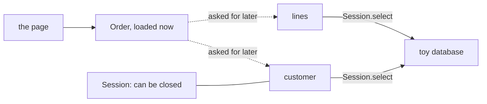

# Lazy Load Pattern — Architecture Diagram

Nothing below the order loads until something asks.

Mermaid source

```mermaid
flowchart LR
    Page["the page"] --> Order["Order, loaded now"]
    Order -.->|asked for later| Cust["customer"]
    Order -.->|asked for later| Lines["lines"]
    Cust -->|Session.select| DB["toy database"]
    Lines -->|Session.select| DB
    Session["Session: can be closed"] --- Cust
```

