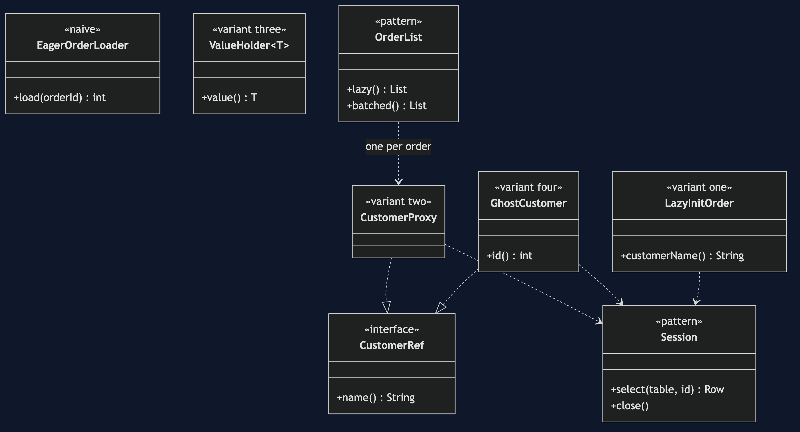
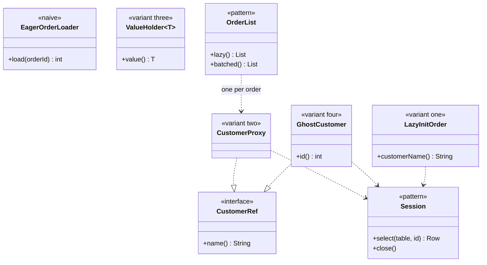

# Lazy Load Pattern — Class Diagram

Four classes solve one problem four ways. They share `Session`, and all fail when it closes.

Mermaid source

```mermaid
classDiagram
    class EagerOrderLoader {
        <<naive>>
        +load(orderId) int
    }
    class Session {
        <<pattern>>
        +select(table, id) Row
        +close()
    }
    class CustomerRef {
        <<interface>>
        +name() String
    }
    class LazyInitOrder {
        <<variant one>>
        +customerName() String
    }
    class CustomerProxy {
        <<variant two>>
    }
    class ValueHolder~T~ {
        <<variant three>>
        +value() T
    }
    class GhostCustomer {
        <<variant four>>
        +id() int
    }
    class OrderList {
        <<pattern>>
        +lazy() List
        +batched() List
    }
    CustomerProxy ..|> CustomerRef
    GhostCustomer ..|> CustomerRef
    CustomerProxy ..> Session
    GhostCustomer ..> Session
    LazyInitOrder ..> Session
    OrderList ..> CustomerProxy : one per order
```

