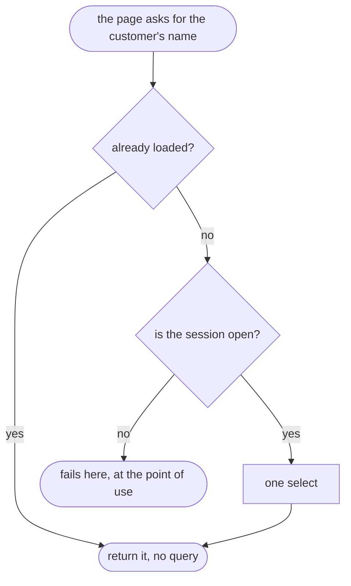

# Lazy Load Pattern — Data Flow Diagram

One access to a lazy field: loaded already, loaded now, or failing.

Mermaid source

```mermaid
flowchart TD
    Ask(["the page asks for the customer's name"])
    Have{"already loaded?"}
    Open{"is the session open?"}
    Ret(["return it, no query"])
    Load["one select"]
    Fail(["fails here, at the point of use"])
    Ask --> Have
    Have -- yes --> Ret
    Have -- no --> Open
    Open -- yes --> Load --> Ret
    Open -- no --> Fail
```

