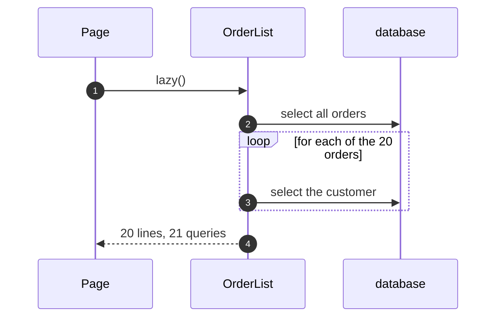

# Lazy Load Pattern — Sequence Diagram

Written for a listener with the screen off.

Say it in words. The page asks the list for twenty orders. The list runs one query for all the orders. Then, for each of the twenty, it makes a proxy and asks for the customer's name. Each proxy runs its own query. Twenty proxies, twenty queries, plus the first: twenty-one.

Mermaid source

The load-bearing sentence: **one query for the list, and then one more for every row in it.**
